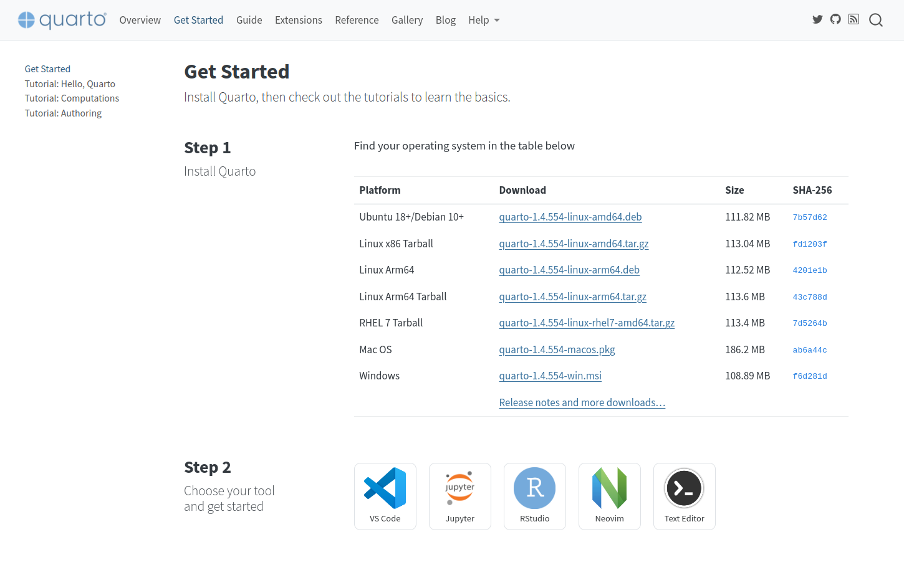
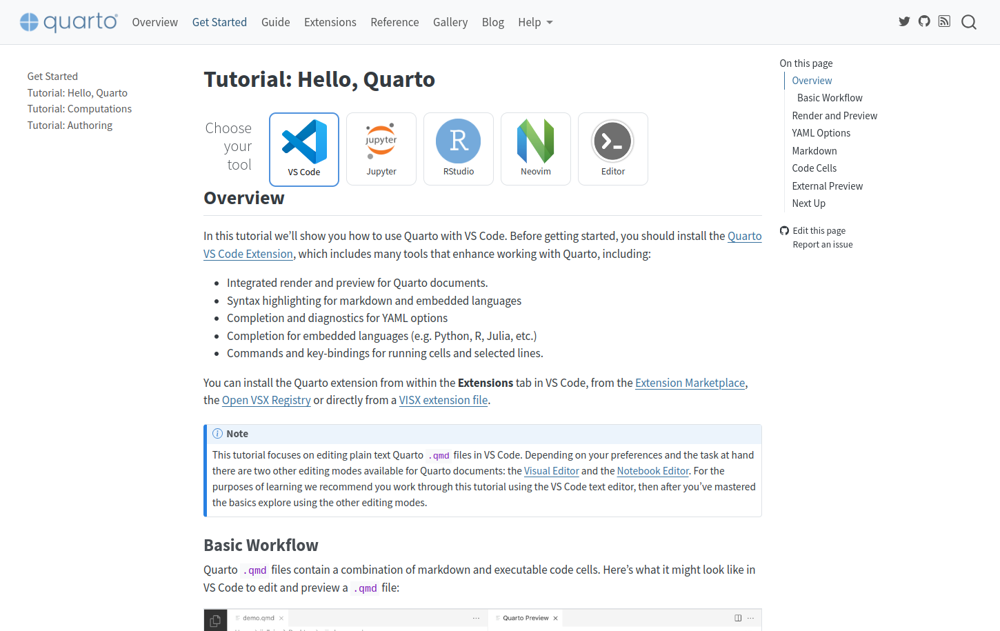
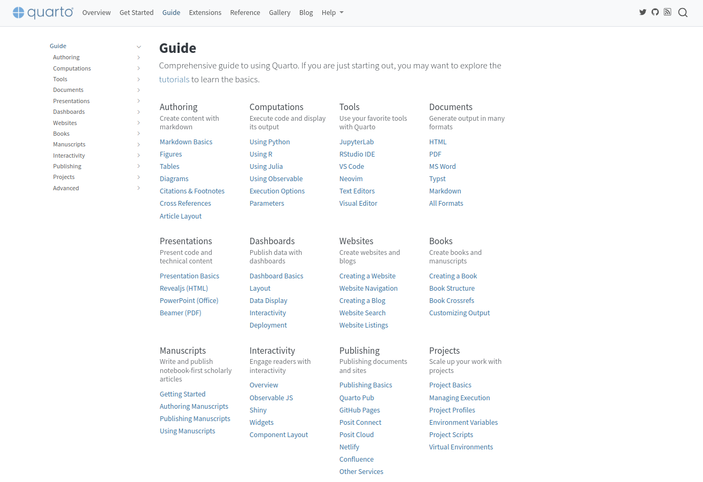
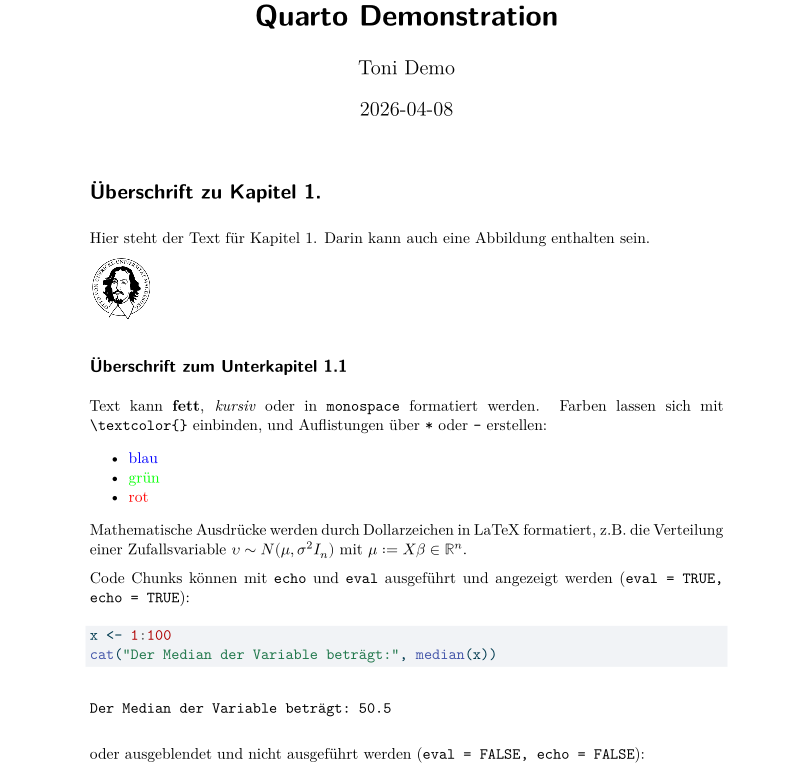
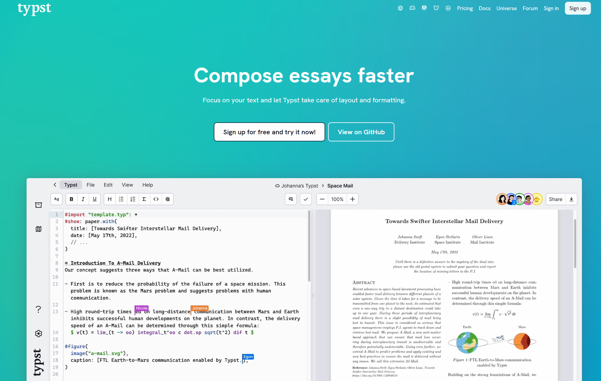
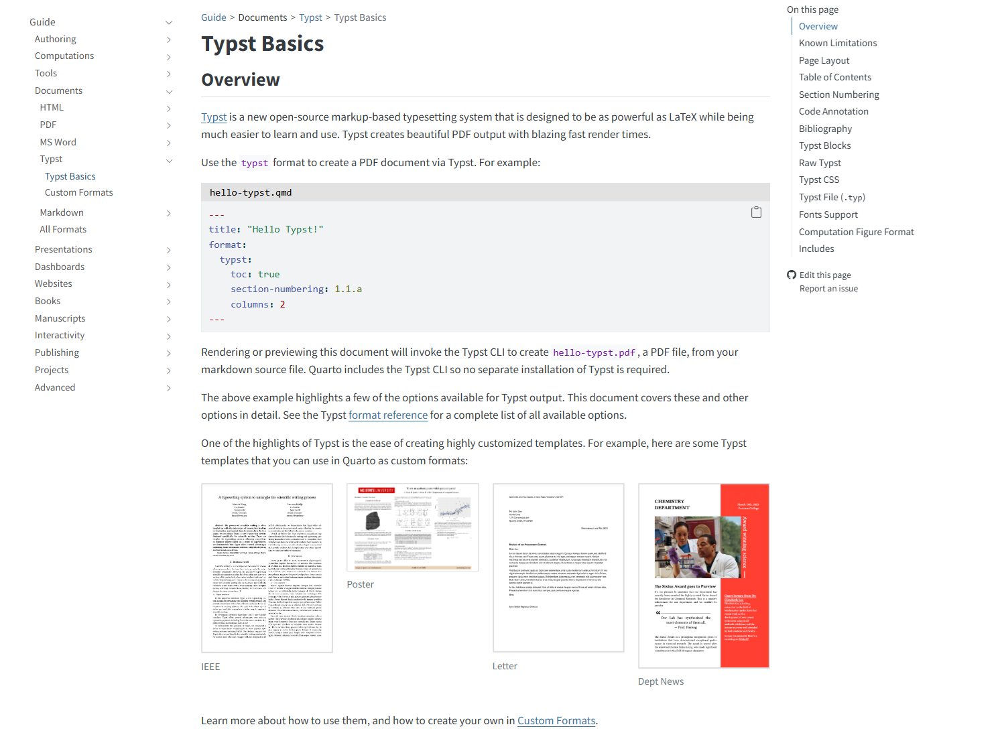
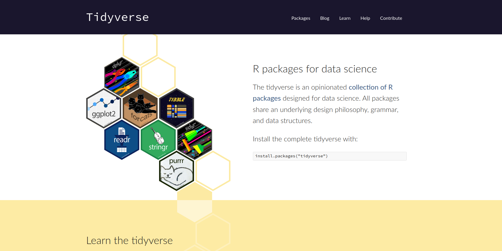
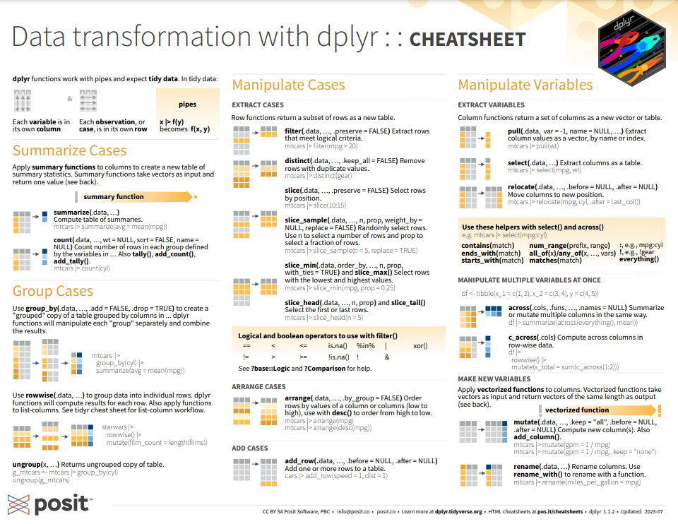
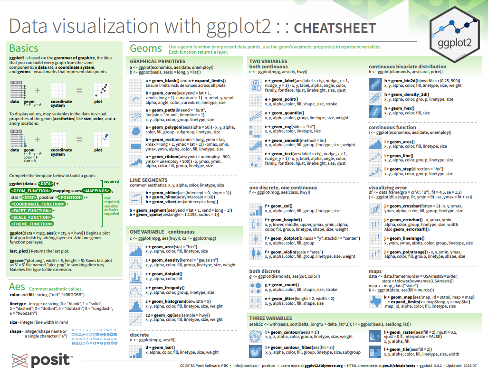

# Titelfolie {.plain}
\center
{width="20%"}

\vspace{2mm}

\Huge
Analyse und Dokumentation
\vspace{4mm}

\Large
BSc Psychologie SoSe 2026

\vspace{5mm}
\large
Belinda Fleischmann


# Termine {.plain}

\setstretch{1.8}
\vfill
\center
\footnotesize

\begin{tabular}{lllll}
Datum     & Gruppe 1  & Gruppe 2  & Format         & Thema                              \\ \hline
\textbf{Fr, 10.04.2026} & \textbf{11-13 Uhr} & \textbf{13-15 Uhr} & \textbf{Seminar} & \textbf{(1) Quarto, Zotero, Tidyverse} \\
Fr, 17.04.2026 & 11-13 Uhr & 13-15 Uhr & Seminar        & (2) Forschungsethik                \\
Fr, 24.04.2026 & 11-13 Uhr & 13-15 Uhr & Seminar        & (3) Wissenschaftliche Berichte     \\
Mi, 29.04.2026 & 11-13 Uhr & 13-15 Uhr & Praxisseminar  &  Offene Übung (Quarto und Zotero)  \\
Fr, 08.05.2026 & 11-13 Uhr & 13-15 Uhr & Seminar        & (4) Offenheit und Transparenz      \\ \hline
Fr, 15.05.2026 & 11-13 Uhr & 13-15 Uhr & Übung          & Einfache Lineare Regression        \\
Mo, 18.05.2026 & 11-13 Uhr & 15-17 Uhr & Übung          & Korrelation                        \\
Fr, 05.06.2026 & 11-13 Uhr & 13-15 Uhr & Übung          & Einstichproben-T-Test              \\
Mi, 10.06.2026 & 13-15 Uhr & 17-19 Uhr & Übung          & Zweistichproben-T-Test             \\
Fr, 26.06.2026 & 11-13 Uhr & 13-15 Uhr & Übung          & Einfaktorielle Varianzanalyse      \\
Fr, 26.06.2026 & 15-17 Uhr & 17-19 Uhr & Übung          & Zweifaktorielle Varianzanalyse     \\
Fr, 03.07.2026 & 11-13 Uhr & 13-15 Uhr & Übung          & Multiple Regression                \\
Fr, 10.07.2026 & 11-13 Uhr & 13-15 Uhr & Übung          & Kovarianzanalyse                   \\ \hline
Fr, 24.07.2026 &           &           & Klausurtermin  &                                    \\
\end{tabular}

\vfill

#  
\vfill
\center
\huge
\textcolor{black}{(1) Quarto, Zotero, Tidyverse}
\vfill


#
\Large
\setstretch{3}
\vfill
Quarto

Zotero

Tidyverse
\vfill


#
\Large
\setstretch{3}
\vfill
**Quarto**

Zotero

Tidyverse
\vfill

# Quarto

\center
\vfill
\textcolor{linkblue}{\href{https://quarto.org/}{Quarto}}

{width=90%}
\vfill


# Quarto
\setstretch{2.3}
\textcolor{darkblue}{Was ist Quarto?}

\small

* Ein seit 2022 verfügbares freies wissenschaftlich-technisches Publikationssystem
* Eine Weiterentwicklung von [\textcolor{linkblue}{RMarkdown}](https://rmarkdown.rstudio.com/) und [\textcolor{linkblue}{RBookdown}](https://bookdown.org/) durch [\textcolor{linkblue}{Posit}](https://posit.co/) 
* RMarkdown/RBookdown sind RStudio Adaptationen von [\textcolor{linkblue}{Markdown}](https://www.markdownguide.org/) und [\textcolor{linkblue}{Jupyter Notebooks}](https://jupyter.org/)
* Allgemeines Ziel ist hier die einfache Integration von ausführbarem Programmiercode 
in ein ansprechendes Text-, Tabellen- und Abbildungslayout für Web- und Printdokumente.
* Quarto nutzt [\textcolor{linkblue}{Markdown}](https://www.markdownguide.org/) und [\textcolor{linkblue}{Latex}](https://www.latex-project.org/) für Layoutprozesse.
* Quarto nutzt [\textcolor{linkblue}{Pandoc}](https://pandoc.org/) für multiple Outputformate (.html, .docx, .pdf, etc.)
* Quarto läuft smoother und schneller als RMarkdown und RBookdown.


# Quarto

\center
\vfill
\textcolor{linkblue}{\href{https://quarto.org/docs/get-started/}{Quarto Installation}}

{width=90%}
\vfill


# Quarto
\center
\vfill
\textcolor{linkblue}{\href{https://quarto.org/docs/get-started/hello/vscode.html}{Quarto VSCode Tutorial}}
 
{width=90%}
\vfill

# Quarto
\textcolor{darkblue}{Was ist Markdown?}
\small

* Eine Markup Language (Auszeichnungssprache) zur Erzeugung formatierten Texts 
* Eine HTML Alternative zur Erstellung von Webseiten etc. mithilfe einfacher Texteditoren
* Von John Gruber und Aaron Swartz 2004 mit dem Ziel hoher Lesbarkeit entwickelt  

\center
\vfill
{width=70%}
\vfill


# Quarto
\textcolor{darkblue}{Was ist Latex?}
\small

* Ein Softwarepaket zur Vereinfachung von [\textcolor{linkblue}{TeX}](https://ctan.org/tex?lang=en)
* [\textcolor{linkblue}{TeX}](https://ctan.org/tex?lang=en) ist ein von Donald Knuth ab 1977 entwickeltes Textsatzsystem mit Makrosprache
* LaTeX wurde von Leslie Lamport Anfang 1984 entwickelt
* LaTeX ist insbesondere für mathematische Berichte und Präsentationen (Beamer) nützlich

\vspace{2mm}
\center
{width=60%}

$\Downarrow$

{width=60%}


# Quarto 

\vspace{1mm}
\center
\textcolor{linkblue}{\href{https://quarto.org/docs/guide/}{Quarto Guide}}
\vspace{1mm}

\center
\vfill
{width=90%}
\vfill


# Quarto
\tiny
\vspace{4mm}
\setstretch{1.0}
````{r, eval = FALSE}
#| label: my_quarto_chunk
#| highlight: markdown
---
title: "Quarto Demonstration"
author: "Toni Demo"
date: today
format: pdf
---

# Überschrift zu Kapitel 1.

Hier steht der Text für Kapitel 1. Darin kann auch eine Abbildung enthalten sein.

{width="10%"}

## Überschrift zum Unterkapitel 1.1

Text kann **fett**, _kursiv_ oder in `monospace` formatiert werden. Farben lassen sich mit `\textcolor{}` einbinden,
und Auflistungen über `*` oder `-` erstellen:

* \textcolor{blue}{blau}
* \textcolor{green}{grün}
- \textcolor{red}{rot}

Mathematische Ausdrücke werden durch Dollarzeichen in LaTeX formatiert, z.B. die Verteilung
einer Zufallsvariable $\upsilon \sim N(\mu, \sigma^2 I_n)$ mit $\mu := X\beta \in \mathbb{R}^n$.

Code Chunks können mit `echo` und `eval` ausgeführt und angezeigt werden (`eval = TRUE, echo = TRUE`):

```{{r, eval = TRUE, echo = TRUE}}
x <- 1:100
cat("Der Median der Variable beträgt:", median(x))
```

oder ausgeblendet und nicht ausgeführt werden (`eval = FALSE, echo = FALSE`):

```{{r, eval = FALSE, echo = FALSE}}
cat("Dieser Code wird weder angezeigt noch ausgeführt.")
```
````


# Quarto {.plain}

\vfill
\center
{width="80%"}

# Quarto
\textcolor{darkblue}{YAML Header}
\setstretch{1.6}
\small

* Jede \texttt{.qmd}-Datei beginnt mit einem YAML Header (zwischen \texttt{---})
* Der YAML Header spezifiziert Metadaten und Formatierungsoptionen
  \vspace{2mm}
  \footnotesize \setstretch{1.2}
  ```yaml
  ---
  title: "Mein Bericht"
  author: "Toni Demo"
  date: today
  format: pdf
  bibliography: Referenzen.bib
  csl: apa.csl
  ---
  ```

\small
* \texttt{format} bestimmt das Ausgabeformat (\texttt{pdf}, \texttt{html}, \texttt{beamer}, etc.)
* \texttt{bibliography} und \texttt{csl} binden Literaturverwaltung ein (siehe Abschnitt Zotero)
* Weitere Formatierungsoptionen z.B. \texttt{fontsize}, \texttt{margin}, \texttt{toc} (Inhaltsverzeichnis), \texttt{number-sections}
* Übersicht verfügbarer YAML Optionen (nach Output-Format): \textcolor{linkblue}{\href{https://quarto.org/docs/reference/}{Quarto Reference}}

# Quarto
\textcolor{darkblue}{Projekt YAML (\texttt{\_quarto.yml})}
\setstretch{1.6}
\small

* Neben dem dokumentspezifischen YAML Header kann es eine projektweite \texttt{\_quarto.yml}-Datei geben
* Diese liegt im Root directory des Projekts und gilt für alle \texttt{.qmd}-Dateien
* Einstellungen im Dokument-YAML überschreiben die Projekteinstellungen
  \vspace{2mm} 
  \footnotesize \setstretch{1.2}
  ```yaml
  project:
    title: "Mein Projekt"

  format:
    pdf:
      include-in-header: Header.tex

  bibliography: Referenzen.bib
  csl: apa.csl
  ```

\small
* Praktisch um gemeinsame Einstellungen (z.B. Header, Bibliographie) nicht in jeder Datei wiederholen zu müssen


#  Quarto
\center
\vfill
\huge 

[\textcolor{linkblue}{Beispielbericht}](https://bit.ly/43niMG1)
\vspace{2mm}

[\textcolor{linkblue}{Beispielpräsentation}](https://bit.ly/45Jh5V2)
\vfill

# Quarto
\center 
\large
[\textcolor{linkblue}{Typst}](https://typst.app/)

\vspace{1mm}

{width="75%"}


# Quarto
\center

[\textcolor{linkblue}{Quarto Typst Integration}](https://quarto.org/docs/output-formats/typst.html)

\vspace{1mm}

{width="80%"}


#
\AtBeginSection{}
\section{Zotero}

\Large
\setstretch{3}
\vfill
Quarto

**Zotero**

Tidyverse
\vfill


# Zotero
\textcolor{darkblue}{Was ist ein Reference Manager?}
\setstretch{2.5}

\small

* Reference Manager sind Literaturverwaltungsprogramme
* Reference Manager unterstützen Zitationen und das Erstellen von Literaturverzeichnissen 
* Zitierstile können automatisch auf bestimmte Spezifikationen (z.B. APA) eingestellt werden
* Reference Manager dienen auch als digitale Bibliotheken
* Kommerzielle Reference Manager sind z.B. EndNote, Citavi, Mendeley und Papers
* Kostenlose/Freemium Reference Manager sind z.B. [\textcolor{linkblue}{JabRef}](https://www.jabref.org/) und [\textcolor{linkblue}{Zotero}](https://www.zotero.org/) 
* Eine Integration in Quarto erlaubt z.B. der Export der eigenen Library in das [\textcolor{linkblue}{BibTex}](http://www.bibtex.org/) Format.


# Zotero

\vfill
\center
\textcolor{linkblue}{\href{https://www.zotero.org/}{Zotero Website}}

\textcolor{linkblue}{\href{https://www.zotero.org/support/}{Zotero Documentation}}

{width=70%}
\vfill

# Zotero
\textcolor{darkblue}{BibTeX Export}
\setstretch{1.5}
\small

* Better BibTeX Plugin installieren: \texttt{zotero-better-bibtex-[version].xpi}-Datei von \textcolor{linkblue}{\href{https://retorque.re/zotero-better-bibtex/}{retorque.re}} herunterladen; in Zotero: \texttt{Tools} $\rightarrow$ \texttt{Plugins} $\rightarrow$ Zahnrad-Symbol $\rightarrow$ \texttt{Install Plugin From File...}
* In Zotero: Rechtsklick auf Sammlung $\rightarrow$ "Export Collection"
* Format: BibTeX $\rightarrow$ Export als \texttt{Referenzen.bib}
* Die \texttt{.bib}-Datei im gleichen Ordner wie die \texttt{.qmd}-Datei speichern
* Im YAML-Header der \texttt{.qmd}-Datei einbinden:

  \vspace{2mm}

  \footnotesize
  ```yaml
  bibliography: Referenzen.bib
  csl: apa.csl
  ```
\small

* APA Citation Style Language (CSL) Datei herunterladen: apa.csl via \textcolor{linkblue}{\href{https://www.zotero.org/styles/}{Zotero Style Repository}}
* Die \texttt{apa.csl}-Datei ebenfalls im gleichen Ordner wie die \texttt{.qmd}-Datei speichern

# Zotero
\textcolor{darkblue}{Zitieren in Quarto}
\setstretch{1.8}
\small

* Jeder Eintrag in der \texttt{.bib}-Datei hat einen eindeutigen Citation Key, z.B. \texttt{noether1918}
* Zitieren im Text mit \texttt{@noether1918} $\rightarrow$ Noether (1918)
* Zitieren in Klammern mit \texttt{[@noether1918]} $\rightarrow$ (Noether, 1918)
* Bei mehreren Autor:innen: \texttt{[@weber2020]} $\rightarrow$ (Weber et al., 2020)
* Mehrere Quellen: \texttt{[@noether1918; @weber2020]} $\rightarrow$ (Noether, 1918; Weber et al., 2020)
* Literaturverzeichnis wird automatisch am Ende des Dokuments eingefügt

#
\AtBeginSection{}
\section{Tidyverse}

\Large
\setstretch{3}
\vfill
Quarto

Zotero

**Tidyverse**
\vfill


# Tidyverse
\large
\center
\textcolor{linkblue}{\href{https://www.tidyverse.org/}{Tidyverse}}

{width="90%" fig-align="center"}

\textcolor{linkblue}{\href{https://posit.co/resources/cheatsheets/}{Cheat Sheets}}


# Tidyverse `dplyr`
\vspace{3mm}

{width="85%" fig-align="center"}

\tiny
\begin{flushright}
\textcolor{linkblue}{\href{https://rstudio.github.io/cheatsheets/data-transformation.pdf}{dplyr Cheat Sheet}}
\end{flushright}

# Tidyverse `dplyr`


\tiny
```{r echo = T, eval = T}
#| label: daten 1 einlesen
#| warning: false

D <- read.csv("./Daten/Daten_1.csv")                        # Daten einlesen
```

\setstretch{1.1}
```{r, eval = T, echo = F, warning = F}
library(knitr)

# Ausgabe des Dataframes
knitr::kable(D, digits = 2)                                 # Markdowntabellenoutput
```


# Tidyverse `dplyr`

\vspace{3mm}
\footnotesize

Der Pipe operater `%>%` oder `|>` ermöglicht es, Funktionen in einer Reihe nacheinander auszuführen.

`mutate()` erlaubt das Erzeugen neuer Spalten als Funktionen bestehender Spalten.

\vspace{2mm}

\tiny
\setstretch{1.1}

```{r echo = T, eval = T}
#| label: dplyr example 1
#| warning: false
library(dplyr)
n <- nrow(D)                                                              # Anzahl Beobachtungen
D_processed <- D %>%                                                      # D wird an nächste Funktion übergeben
  mutate(ID = seq(n)) %>%                                                 # ID-Spalte hinzufügen
  mutate(Summe = Variable_1 + Variable_2 + Variable_3)                    # Summen-Spalte hinzufügen
```

\setstretch{1}
```{r, eval = T, echo = F, warning = F}
library(knitr)

# Ausgabe des neuen Dataframes
knitr::kable(D_processed, digits = 2, align = "ccc", caption = NULL)     # Markdowntabellenoutput
```


# Tidyverse `dplyr`
\vspace{3mm}

\tiny
\footnotesize
`filter()` erlaubt es, Zeilen gemäß bestimmten Bedingungen auszuwählen.
\vspace{2mm}


\tiny
```{r echo = T, eval = T}
#| label: dplyr example 2

D_selected <- D_processed %>%
  filter(ID %in% 1:10) %>%                               # Auswahl der IDs 1-10
  filter(Summe > 90)                                     # Selektion der Beobachtungen mit Summe > 90
```

\setstretch{1.1}
```{r, eval = T, echo = F, warning = F}
library(knitr)

# Ausgabe des neuen Dataframes
knitr::kable(D_selected, digits = 2, caption = NULL)     # Markdowntabellenoutput
```

\vfill


# Tidyverse `ggplot2`

\vspace{3mm}

{width="85%" fig-align="center"}

\tiny
\begin{flushright}
\textcolor{linkblue}{\href{https://rstudio.github.io/cheatsheets/data-visualization.pdf}{ggplot2 Cheat Sheet}}
\end{flushright}


# Tidyverse `ggplot2`

\textcolor{darkblue}{Beispieldatensatz}
\vfill

\tiny

```{r echo = T, eval = T}
library(dplyr)                                                      # Für Pipe (%>%), mutate()

# Daten vorbereiten
D <- read.csv("./Daten/Daten_2.csv")                                # Daten einlesen
n_pat <- nrow(D)                                                    # Anzahl Patientinnen
D_processed <- D %>%                                                # PatientIn ID hinzufügen
  mutate(PatientIn = seq(n_pat))
```


\small
Die ersten 12 Zeilen des Dataframes: 

\tiny
\setstretch{1.1}
```{r, eval = T, echo = F, warning = F}
library(knitr)

# Ausgabe der ersten 6 Zeilen jeder Gruppe
knitr::kable(head(D_processed, n=12L), digits = 2, caption = NULL)
```


# Tidyverse `ggplot2`

\vspace{2mm}
\tiny
\setstretch{1.1}

```{r echo = F, eval = F}
#| label: Maße
# Lineare Regression durchführen
lm_model <- lm(BDI ~ DUR, data = D_processed)

# Steigung (slope) extrahieren
beta_1 <- coef(lm_model)["DUR"]

# y-Achsenabschnitt (intercept) extrahieren
beta_0 <- coef(lm_model)["(Intercept)"]

# Korrelation bestimmen
r <- cor(D$BDI, D$DUR)

# Beschriftung
beschriftung <- sprintf(
  "r = %.2f, beta_0 = %.2f, beta_1 = %.2f", r, beta_0, beta_1
)
```

```{r echo = T, eval = F}
#| label: fig-ausgleichsgerade
#| fig-cap: "Dauer der Depressionssymptomatik und Prä-Post BDI-Differenz."
#| warning: false
library(ggplot2)                                         # Für ggplot()

# Visualisierung
ggplot(
  data = D_processed,                                    # Daten
  mapping = aes(x = DUR, y = BDI)                        # Daten-Axen-mapping
  ) +
  coord_cartesian(ylim = c(-10, 20)) +                   # y-limits anpassen
  geom_point() +                                         # Datenpunkte zeichnen
  geom_smooth(                                           # Ausgleichsgerade zeichnen
    method = "lm",
    color = "green", se = F, linewidth = 0.4
    ) +
  ylab("BDI Diff") + xlab("Dauer Symptomatik [Monate]")  # Achsenbeschriftung
graphics.off()                                           # Schließt browser

ggsave(                                                  # Abbildung speichern
  filename = "ggplot_beispiel.pdf",
  height = 5, width = 5
)
```


# Tidyverse `ggplot2`

\vfill

{width="60%" fig-align="center"}


# Quellen
\vfill
\setstretch{2.7}

\textcolor{linkblue}{\href{https://code.visualstudio.com/docs/languages/r}{VS Code Website}}

\textcolor{linkblue}{\href{https://github.com/REditorSupport/vscode-R/wiki}{VS Code-R Wiki}}

\textcolor{linkblue}{\href{https://r4ds.hadley.nz/}{R for Data Science (2e)}}

\textcolor{linkblue}{\href{https://ggplot2-book.org/}{ggplot2: Elegant Graphics for Data Analysis (3e)}}
\vfill
