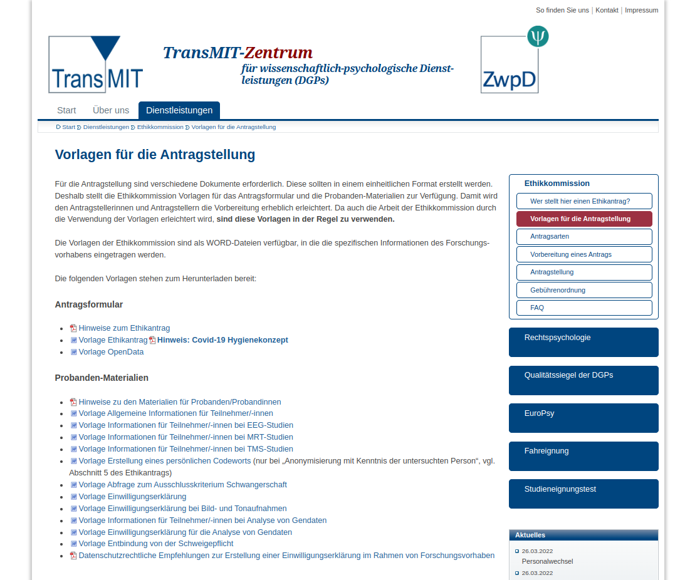

# Titelfolie {.plain}
\center
{width="20%"}

\vspace{2mm}

\Huge
Analyse und Dokumentation
\vspace{4mm}

\Large
BSc Psychologie SoSe 2026

\vspace{5mm}
\large
Belinda Fleischmann

# Termine {.plain}

\setstretch{1.8}
\vfill
\center
\footnotesize

\begin{tabular}{lllll}
Datum     & Gruppe 1  & Gruppe 2  & Format         & Thema                              \\ \hline
Fr, 10.04.2026 & 11-13 Uhr & 13-15 Uhr & Seminar & (1) Quarto, Zotero, Tidyverse \\
\textbf{Fr, 17.04.2026} & \textbf{11-13 Uhr} & \textbf{13-15 Uhr} & \textbf{Seminar} & \textbf{(2) Forschungsethik} \\
Fr, 24.04.2026 & 11-13 Uhr & 13-15 Uhr & Seminar        & (3) Wissenschaftliche Berichte     \\
Mi, 29.04.2026 & 11-13 Uhr & 13-15 Uhr & Praxisseminar  &  Offene Übung (Quarto und Zotero)  \\
Fr, 08.05.2026 & 11-13 Uhr & 13-15 Uhr & Seminar        & (4) Offenheit und Transparenz      \\ \hline
Fr, 15.05.2026 & 11-13 Uhr & 13-15 Uhr & Übung          & Einfache Lineare Regression        \\
Mo, 18.05.2026 & 11-13 Uhr & 15-17 Uhr & Übung          & Korrelation                        \\
Fr, 05.06.2026 & 11-13 Uhr & 13-15 Uhr & Übung          & Einstichproben-T-Test              \\
Mi, 10.06.2026 & 13-15 Uhr & 17-19 Uhr & Übung          & Zweistichproben-T-Test             \\
Fr, 26.06.2026 & 11-13 Uhr & 13-15 Uhr & Übung          & Einfaktorielle Varianzanalyse      \\
Fr, 26.06.2026 & 15-17 Uhr & 17-19 Uhr & Übung          & Zweifaktorielle Varianzanalyse     \\
Fr, 03.07.2026 & 11-13 Uhr & 13-15 Uhr & Übung          & Multiple Regression                \\
Fr, 10.07.2026 & 11-13 Uhr & 13-15 Uhr & Übung          & Kovarianzanalyse                   \\ \hline
Fr, 24.07.2026 &           &           & Klausurtermin  &                                    \\
\end{tabular}

\vfill

#  
\vfill
\center
\huge
\textcolor{black}{(2) Forschungsethik}
\vfill

#
\large
\setstretch{2.5}
\vfill

Einführung

Ethische Grundprinzipien

Ethikantragsstellung

Vorlagen für Ethikanträge

Selbstkontrollfragen
\vfill

#      
\AtBeginSection{}
\section{Einführung}

\large
\vfill
\setstretch{2.5}

**Einführung**

Ethische Grundprinzipien

Ethikantragsstellung

Vorlagen für Ethikanträge

Selbstkontrollfragen
\vfill

# Motivation

\textcolor{darkblue}{Warum sprechen wir über Ethik?}

\setstretch{2}
* In psychologischer Forschung sind Menschen "Untersuchungsobjekte"
* $\Rightarrow$ Ethische Verantwortbarkeit und rechtliche Rahmenbedingungen?

\textcolor{darkblue}{Zentrale Ziele}

* \textbf{Abwenden von "Schaden an Personen"}
* \textbf{Freiwilligkeit} der Teilnahme an Studien (Informierte Zustimmung)

# Motivation
\vspace{2mm}
Negativbeispiele 

\center
{width="90%"}

# Motivation
\center
\large
Zürich-Reddit-Chatbot-Studie 2025
\vspace{4mm}

{width="80%"}

\vspace{3mm}

\normalsize
Presseschau

[\textcolor{linkblue}{Reddit}](https://www.reddit.com/r/changemyview/comments/1k8b2hj/meta_unauthorized_experiment_on_cmv_involving/),
[\textcolor{linkblue}{Science}](https://www.science.org/content/article/unethical-ai-research-reddit-under-fire),
[\textcolor{linkblue}{Retraction Watch}](https://retractionwatch.com/2025/04/28/experiment-using-ai-generated-posts-on-reddit-draws-fire-for-ethics-concerns/),
[\textcolor{linkblue}{Washington Post}](https://www.washingtonpost.com/technology/2025/04/30/reddit-ai-bot-university-zurich/),
[\textcolor{linkblue}{New Scientist}](https://www.newscientist.com/article/2478336-reddit-users-were-subjected-to-ai-powered-experiment-without-consent/)

# Was ist Ethik?
\setstretch{2}

\textcolor{darkblue}{Allgemeine Definition von Ethik}

\setstretch{1.5}
\small
"Die Ethik ist jener Teilbereich der Philosophie, der sich mit den Voraussetzungen und der Bewertung menschlichen Handelns befasst. Ihr Gegenstand ist damit die Moral insbesondere hinsichtlich ihrer Begründbarkeit und Reflexion. Cicero übersetzte als erster êthikê téchnē (die ethische Kunst) in den seinerzeit neuen Begriff philosophia moralis (Philosophie der Sitten). In seiner Tradition wird die Ethik auch heute noch als Moralphilosophie bezeichnet."

\flushright
(Wikipedia)

\flushleft
\normalsize

\textcolor{darkblue}{Ethik im Kontext der Psychologie}

\setstretch{2}

* \small Berufsethische Richtlinien
* Ethischer Umgang mit Menschen in der Forschung
* Ethischer Umgang mit Daten
* Wissenschaftliche Transparenz

# Grundlagen und Quellen
\vfill
\textcolor{darkblue}{Rechtlicher Rahmen}
\setstretch{1.6}
\small

\begin{itemize} \justifying
\item \setstretch{1.6} Gesetzgebung in Deutschland gibt keine gesetzlichen Rahmen zur Forschung an und mit Menschen (anders als in beispielsweise Großbritannien oder Norwegen).
\item Rechtliche Normen werden allgemein dem \textcolor{linkblue}{\href{https://www.gesetze-im-internet.de/gg/BJNR000010949.html}{Grundgesetz}}, Artikel 1 und 2 entnommen.
\item Im Bereich humanmedizinischer Forschung sind im speziellen das \textcolor{linkblue}{\href{https://www.gesetze-im-internet.de/amg_1976/}{Arzneimittelgesetz (AMG)}} und das \textcolor{linkblue}{\href{https://www.gesetze-im-internet.de/mpdg/}{Medizinproduktedurchführungsgesetz (MPDG)}} relevant.
\item Die Mehrheit der Leitlinien und Grundprinzipien haben ihren Ursprung in der Medizin, da ethische Fragestellungen in der klinischen Forschung elaborierter sind.
\end{itemize}

\vspace{3mm}

{width="25%" fig-align="right"}

# Grundlagen und Quellen
\vfill
\textcolor{darkblue}{Wichtigste Quellen}
\setstretch{1.5}
\small

* \small \textcolor{linkblue}{\href{https://www.wma.net/policies-post/wma-declaration-of-helsinki-ethical-principles-for-medical-research-involving-human-subjects/}{Declaration of Helsinki}} (deutsche Übersetzung \textcolor{linkblue}{\href{https://www.bundesaerztekammer.de/fileadmin/user_upload/_old-files/downloads/pdf-Ordner/International/Deklaration_von_Helsinki_2013_20190905.pdf}{hier}}): Ethische Grundsätze für die medizinische Forschung am Menschen [@wma2013]
* \textcolor{linkblue}{\href{http://www.apa.org/ethics/code/index.html}{Ethical Principles of Psychologists and Code of Conduct}} [@apa2017] \small 
  * \small Prinzipien A-E
  * 10 Ethical standards für spezifische Themen
  * Insbesondere Section 8: Research and Publication
* \small \textcolor{linkblue}{\href{https://www.hogrefe.com/de/shop/ethisches-handeln-in-der-psychologischen-forschung-75906.html}{Ethisches Handeln in der psychologischen Forschung}} [@dgps2018]
  * \small Leitlinien und Prinzipien (i.A. an APA und WMA)
  * Good practice Beispiele
* \textcolor{linkblue}{\href{https://zwpd.transmit.de/zwpd-dienstleistungen/zwpd-ethikkommission/vorlagen-antragstellung}{Mustervorlagen}} für Ethikanträge, Teilnehmendeninformationen, Einwilligungserklärungen usw.

\vfill

# Ethische Grundprinzipien 
\AtBeginSection{}
\section{Ethische Grundprinzipien}

\large
\vfill
\setstretch{2.5}

Einführung

**Ethische Grundprinzipien**

Ethikantragsstellung

Vorlagen für Ethikanträge

Selbstkontrollfragen
\vfill

# Ethische Grundsätze in der \textcolor{darkblue}{Deklaration von Helsinki}

\setstretch{2}
\normalsize
\textcolor{darkblue}{Allgemeine Grundsätze}
\small
\setstretch{1.4}
\begin{itemize} \justifying
\item Erweiterung der \textbf{ärztlichen Pflicht (internationaler Kodex)}, das Leben, Gesundheit, Würde, Integrität, Selbstbestimmungsrecht und Privatsphäre von Patient:innen zu fördern und zu erhalten, auf die medizinische Forschung.
\item Vorrangiges Ziel medizinischer Forschung (Ursachen, Entwicklung und Auswirkungen von Erkrankungen verstehen und präventive, diagnostische und therapeutischen Maßnahmen verbessern) darf \textbf{niemals Vorrang vor den Rechten und Interessen von Versuchspersonen} haben.
\item Die \textbf{Verantwortung} für den Schutz von Versuchspersonen liegt \textbf{stets bei Ärzt:innen} und nie bei der Versuchsperson selbst, auch wenn sie ihr Einverständnis gegeben hat.
\item Angemessener Zugang zur Teilnahme für \textbf{unterrepräsentierte Gruppen}.
\item Angemessene \textbf{Entschädigung und Behandlung} von Versuchspersonen.
\end{itemize}

\flushright
\footnotesize
@wma2013

# Ethische Grundsätze in der \textcolor{darkblue}{Deklaration von Helsinki}

\setstretch{2}
\normalsize
\textcolor{darkblue}{Risiken, Belastungen und Nutzen}
\small
\setstretch{1.4}
\begin{itemize} \justifying
\item \textbf{Sorgfältige Abschätzung} der voraussehbaren Risiken und Belastungen für beteiligte Einzelpersonen und Gruppen im Vergleich zu dem voraussichtlichen Nutzen.
\item Medizinische Forschung am Menschen darf nur durchgeführt werden, wenn die Bedeutung des Ziels die Risiken und Belastungen für die Versuchspersonen \textbf{überwiegt}.
\item Maßnahmen zur \textbf{Risikominimierung}.
\item Kontinuierliche \textbf{Überwachung} und Einschätzung, und ggf. Entscheidung über \textbf{Modifizierung} oder \textbf{Abbruch}.
\end{itemize}

\setstretch{2}
\normalsize
\textcolor{darkblue}{Vulnerable Gruppen und Einzelpersonen}
\small
\setstretch{1.4}
\begin{itemize}
\item Besonderer Schutz für alle \textbf{vulnerablen} Gruppen und Einzelpersonen.
\end{itemize}

\flushright
\footnotesize
@wma2013

# Ethische Grundsätze in der \textcolor{darkblue}{Deklaration von Helsinki}
\setstretch{2}
\normalsize
\textcolor{darkblue}{Wissenschaftliche Anforderungen und Forschungsprotokolle}
\small
\setstretch{1.4}
\begin{itemize} \justifying
\item Verfolgen allgemein anerkannter \textbf{wissenschaftlicher Grundsätze}.
\item Basis einer gründlichen Kenntnis der \textbf{wissenschaftlichen Literatur} und relevanten Informationsquellen.
\item Klare Beschreibung und Rechtfertigung der Planung und Durchführung in einem \textbf{Studienprotokoll}.
\end{itemize}

\setstretch{2}
\normalsize
\textcolor{darkblue}{Forschungs-Ethikkommissionen} \justifying
\small
\setstretch{1.4}
\begin{itemize}
\item Vorlage des Studienprotokolls bei \textbf{zuständiger Ethikkommission} zur Erwägung, Stellungnahme, Beratung und Zustimmung.
\end{itemize}

\setstretch{2}
\normalsize
\textcolor{darkblue}{Privatsphäre und Vertraulichkeit}
\small
\setstretch{1.4}
\begin{itemize} \justifying
\item Wahrung der \textbf{Privatsphäre} der Versuchspersonen und die \textbf{Vertraulichkeit} ihrer persönlichen Informationen.
\end{itemize}

\flushright
\footnotesize
@wma2013

# Ethische Grundsätze in der \textcolor{darkblue}{Deklaration von Helsinki}

\setstretch{2}
\normalsize
\textcolor{darkblue}{Informierte Einwilligung}
\small
\setstretch{1.4}
\begin{itemize} \justifying
\item \textbf{Freiwilligkeit} der Teilnahme.
\item Angemessene \textbf{Aufklärung} über die Ziele, Methoden, Geldquellen, eventuelle Interessenkonflikte, institutionelle Verbindungen des Forschers, den erwarteten Nutzen und die potentiellen Risiken der Studie, mögliche Unannehmlichkeiten, vorgesehene Maßnahmen nach Abschluss einer Studie sowie alle anderen relevanten Aspekte.
\item Aufklärung über das Recht, die Teilnahme an der Studie zu \textbf{verweigern} oder eine einmal gegebene Einwilligung \textbf{jederzeit} zu \textbf{widerrufen}, ohne dass irgendwelche Nachteile entstehen.
\item Die Weigerung oder Zustimmung einer Patient:in darf \textbf{niemals} die Patienten-Arzt-Beziehung \textbf{nachteilig} beeinflussen.
\item Informierte Einwilligung zur Verwendung \textbf{identifizierbarer menschliche Materialien oder Daten}.
\end{itemize}

\flushright
\footnotesize
@wma2013

# Ethische Grundsätze in der \textcolor{darkblue}{Deklaration von Helsinki}

\setstretch{2}
\normalsize
\textcolor{darkblue}{Die Verwendung von Placebos} \justifying
\small
\setstretch{1.4}
\begin{itemize}
\item Nur erlaubt, wenn keine nachgewiesene Maßnahme existiert, oder wenn sie \textbf{notwendig} sind, um die Wirksamkeit oder Sicherheit einer Maßnahme festzustellen, und wenn kein zusätzliches Risiko eines ernsten oder irreversiblen Schadens besteht.
\end{itemize}

\setstretch{2}
\normalsize
\textcolor{darkblue}{Maßnahmen nach Abschluss einer Studie}
\small
\setstretch{1.4}
\begin{itemize}
\item Vorkehrungen für Maßnahmen \textbf{nach Abschluss der Studie} für alle Teilnehmenden treffen, die noch eine Maßnahme benötigen, die in der Studie als nützlich erkannt wurde.
\end{itemize}

\flushright
\footnotesize
@wma2013

# Ethische Grundsätze in der \textcolor{darkblue}{Deklaration von Helsinki}

\setstretch{2}
\normalsize
\textcolor{darkblue}{Registrierung von Forschung sowie Publikation und Verbreitung von Ergebnissen}
\small
\setstretch{1.4}
\begin{itemize} \justifying
\item \textbf{Registrierung} von Forschungsvorhaben in einer \textbf{öffentlich zugänglichen Datenbank} \textit{vor} der Rekrutierung der ersten Versuchsperson.
\item Verpflichtung von Forschenden, \textbf{Ergebnisse} ihrer Forschung am Menschen \textbf{öffentlich verfügbar} zu machen und Rechenschaftspflicht im Hinblick auf die Vollständigkeit und Richtigkeit ihrer Berichte.
\item \textbf{Negative und nicht schlüssige Ergebnisse} müssen ebenso wie positive veröffentlicht oder in anderer Form öffentlich verfügbar gemacht werden.
\end{itemize}

\setstretch{2}
\normalsize
\textcolor{darkblue}{Nicht nachgewiesene Maßnahmen in der klinischen Praxis}
\small
\setstretch{1.4}
\begin{itemize} \justifying
\item Anwendung nicht nachgewiesener Maßnahmen nur dann zulässig, wenn nachgewiesene Maßnahmen unwirksam waren, wenn Hoffnung besteht, das Leben zu retten, die Gesundheit wiederherzustellen oder Leiden zu lindern.
\end{itemize}

\flushright
\footnotesize
@wma2013

# Psychologisch-ethische \textcolor{darkblue}{Grundprinzipien der APA}

\setstretch{2}
\normalsize
\textcolor{darkblue}{A: Fürsorge und Nichtschädigung} (beneficence and nonmaleficence)
\small
\setstretch{1.3}
\begin{itemize} \justifying
\item Psycholog:innen streben stets danach, den Personen, mit denen sie arbeiten, \textbf{Nutzen und keinen Schaden} zuzufügen, und deren Wohl und Rechte zu schützen.
\end{itemize}

\setstretch{2}
\normalsize
\textcolor{darkblue}{B: Redlichkeit und Verantwortlichkeit} (fidelity and responsibility)
\small
\setstretch{1.3}
\begin{itemize} \justifying
\item Aufbau vertrauensvoller \textbf{Beziehungen}.
\item Bewusstsein für \textbf{gesellschaftliche Verantwortung} und Einhaltung professioneller \textbf{Standards}.
\end{itemize}

\setstretch{2}
\normalsize
\textcolor{darkblue}{C: Integrität} (integrity)
\small
\setstretch{1.3}
\begin{itemize} \justifying
\item Streben nach \textbf{Akkuratheit} und \textbf{Ehrlichkeit} in Forschung, Lehre und Praxis der Psychologie.
\item Vermeidung von Diebstahl, Betrug oder \textbf{Täuschung}.
\item Im Falle notwendiger Täuschung, \textbf{Abwägung} ethischer Rechtfertigbarkeit, Berücksichtigung und \textbf{Verantwortungsübernahme} für alle möglichen \textbf{Konsequenzen}
\end{itemize}

\flushright
\footnotesize
@apa2017

# Psychologisch-ethische \textcolor{darkblue}{Grundprinzipien der APA}

\setstretch{2}
\normalsize
\textcolor{darkblue}{D: Gerechtigkeit} (justice)
\small
\setstretch{1.3}
\begin{itemize}  \justifying
\item \textbf{Fairness und Gerechtigkeit} für alle Personen.
\item \textbf{Gleichberechtigter Zugang} zu und Nutzen von psychologischer Arbeit für alle.
\item Vorsicht hinsichtlich persönlicher Vorurteile und Kompetenzgrenzen.
\end{itemize}

\setstretch{2}
\normalsize
\textcolor{darkblue}{E: Respekt von persönlichen Rechten und Würde der Person} 
\vspace{-1mm}

(respect for people’s right and dignity)

\small
\setstretch{1.3}
\begin{itemize} \justifying
\item Achtung der \textbf{Würde} und des \textbf{Wertes} aller Menschen.
\item Respektieren der Rechte auf \textbf{Privatsphäre}, \textbf{Vertraulichkeit} und \textbf{Selbstbestimmung}.
\item Besondere Rücksicht auf \textbf{vulnerable Personen}, und Beachtung kultureller, individueller und rollenspezifischer \textbf{Unterschiede} (Faktoren wie Alter, Geschlecht, Geschlechtsidentität, "Rasse", Ethnizität, Kultur, Religion, sexueller Orientierung, Behinderung, Sprache und sozioökonomischem Status).
\end{itemize}

\flushright
\footnotesize
@apa2017

# Psychologisch-ethische \textcolor{darkblue}{Grundprinzipien der APA}

\setstretch{2}
\normalsize
\textcolor{darkblue}{Section 8: Research and Publication}
\small
\setstretch{1.1}
\begin{itemize} \justifying
\item Institutional Approval
\item Informed Consent
\item Offering Inducements for Research Participation
\item Deception in Research
\item Debriefing
\item Humane Care and Use of Animals in Research
\item Reporting Research Results
\item Plagiarism, Publication Credit
\item Sharing Research Data for Verification
\end{itemize}

# Leitfaden der DGPs

\vfill

{fig-align="center" width="40%"}

\flushright
\tiny
@dgps2018

# \textcolor{darkblue}{\textbf{Prinzipien nach DGPs}}

\setstretch{2}
\vfill

{width="100%" fig-align="center"}

\footnotesize

Wichtige Anmerkungen:

\setstretch{1.1}
\justifying
* Die Befolgung dieser vier Prinzipien bedeutet nicht automatisch, dass ein Forschungsvorhaben unbedenklich ist und garantiert kein positives Votum einer Ethikkommission.
* "Die zu behandelnden Prinzipien stellen Wegweiser dar, den Weg zum Ziel einer ethisch verantwortbaren Studie müssen die am Forschungsprozess Beteiligten finden." (DGPs, 2018, S. 24)

#
\AtBeginSubsection{}
\subsection{Respekt vor Selbstbestimmung}

\large
\vfill
\setstretch{2}

Einführung

**Ethische Grundprinzipien**

\normalsize
\setstretch{1.5}

* **Respekt vor Selbstbestimmung**
* Nichtschädigung
* Fürsorge
* Gerechtigkeit

\large
\setstretch{2}

Ethikantragsstellung

Vorlagen für Ethikanträge

Selbstkontrollfragen
\vfill

# Respekt vor Selbstbestimmung
\textcolor{darkblue}{Grundlegendes Prinzip}

"Das Prinzip des Respekts vor der Selbstbestimmung unterstreicht die strikte 
Beachtung der **Freiwilligkeit** der Teilnahme an einer wissenschaftlichen 
Untersuchung in **allen Phasen** und **allen Teilen**." 

\vfill
\normalsize
\textcolor{darkblue}{Zentrale Aspekte}

* Freiwilligkeit der Teilnahme
* Teilnehmendeninformation
* Experimente mit Täuschung / Cover story
* Die (formale) Einwilligungserklärung

\vfill

# Respekt vor Selbstbestimmung

\setstretch{2}
\normalsize
**Freiwilligkeit der Studienteilnahme**

\small
\setstretch{1.3}
Studienteilnehmer:innen soll es möglich sein, ohne Zwang eine autonome Entscheidung über ihre Teilnahme an einer Studie zu treffen. 

\vfill

\setstretch{2}
\normalsize
Zentrale Aspekte
\small
\setstretch{1.3}
\begin{itemize} \justifying \small
\item \textbf{Rekrutierung}: Jede Maßnahme ist so zu gestalten, dass eine freie, unbeeinflusste Abwägung, teilzunehmen oder nicht teilzunehmen möglich ist.
\item \textbf{Aufwandsentschädigung}: Ethisch problematisch wird eine Kompensation, wenn sie eine Höhe annimmt, in der Teilnehmende gegen Geld Risiken eingehen, die sie ohne die Zahlung nicht eingegangen wären.
\item \textbf{Recht auf vorzeitigen Abbruch}: Teilnehmende müssen zu jedem Zeitpunkt das Recht haben, eine Studie \textit{uneingeschränkt} (d.h. ohne, dass ihnen dadurch ein Nachteil entsteht) abzubrechen \textit{und} darüber informiert sein.
\end{itemize}
\vfill

# Respekt vor Selbstbestimmung

\setstretch{2}
\normalsize
\textcolor{darkcyan}{Fallbeispiel}
\small
\setstretch{1.3}
\begin{itemize} \justifying
\item Forschung zum Einfluss von Stress auf die Häufung und Intensität negativer Gefühle in Träumen.
\item Anforderungen an Teilnehmende: Fragebögen und Traumtagebuch (14 Tage)
\item Forscherin: Professorin und behandelt in ihrer Vorlesung das Thema Träume
\item Rekrutierung im Rahmen der Vorlesung
\item Aushänge und Flyer am Campus mit Werbung, dass Teilnehmende für ausgefüllte Fragebögen und Traumtagebuch über 14 Tage Entschädigung bekommen (10€ oder 2 VPh)
\end{itemize}
\vfill

\center
**Welche ethischen Bedenken hat dieses Forschungsvorhaben?**

# Respekt vor Selbstbestimmung

\setstretch{2}
\normalsize
\textcolor{darkcyan}{Fallbeispiel (Forts.)}
\vfill
Rekrutierung
\small
\setstretch{1.2}
\begin{itemize} \justifying
\item Ethisch bedenklich, da nicht auszuschließen ist, dass Studierende nur deshalb an der Studie teilnehmen, um ihre Professorin nicht zu enttäuschen, oder befürchten, in der Prüfung Nachteile zu haben
\item Ethisch weniger bedenklich: Sicherstellen voller Anonymität (z.B. Ausgabe Fragebögen in Abwesenheit der Professorin \textbf{und} offene Kommunikation gegenüber Studierenden)
\end{itemize}

\setstretch{2}
\normalsize
Aufwandsentschädigung
\small
\setstretch{1.3}
\begin{itemize} \justifying
\item Abwägung angemessener Höhe der Aufwandsentschädigung
\item Fairer Ausgleich für Zeit und Risiko vs. derart hoch, dass Freiwilligkeit der Studienteilnahme beeinflusst
\item Risiko, Stichprobe hinsichtlich sozioökonomischen Hintergrund zu verzerren.
\end{itemize}

# Respekt vor Selbstbestimmung

**Teilnehmendeninformation**

\small 

Offenlegen der Ziele und Anforderungen einer Studie, sodass Studienteilnehmende in die Lage versetzt werden, mögliche Risiken und Vorteile einer Teilnahme abzuwägen.

\vfill

\setstretch{2}
\normalsize
Zentrale Aspekte
\small
\setstretch{1.2}
\begin{itemize} \justifying
\item Vollständigkeit, Nachvollziehbarkeit und Verständlichkeit aller relevanten Informationen.
\item Angemessene Umfang bzw. Detailliertheit der Informationen 
\item "Reasonable person standard“: einer vernünftigen (reasonable) Person wird ermöglicht wird, eine Entscheidung zu treffen, die ihren Werten entspricht.
\item Möglichkeit sowie ausreichend Zeit, Fragen zu stellen.
\item Zusätzliche Information bei Interventionsstudien
\end{itemize}

\vfill
\footnotesize

Anmerkung:

\setstretch{1.3}

* \textcolor{linkblue}{\href{https://zwpd.transmit.de/zwpd-dienstleistungen/zwpd-ethikkommission/vorlagen-antragstellung}{Mustervorlagen der DGPs}} für Allgemeine Informationen für Teilnehmer/-innen und spezifische Studien (z.B. für MRT-Studien, EEG-Studien).
* Beispielformulierungen und Checkliste für Teilnehmendeninformation in \textcolor{linkblue}{\href{https://www.hogrefe.com/de/shop/ethisches-handeln-in-der-psychologischen-forschung-75906.html}{Ethisches Handeln in der psychologischen Forschung}} [@dgps2018]

# Respekt vor Selbstbestimmung

\setstretch{2}
\normalsize
Inhalt einer Teilnehmendeninformation
\small
\setstretch{1.3}
\begin{itemize} \justifying
\item Ziel der Studie
\item Aufnahmebedingungen, Ein- und Ausschlusskriterien
\item Aufgaben der Versuchspersonen, Zeitlicher Aufwand 
\item Mögliche Risiken oder Belastungen (physisch, emotional etc.) und Nutzen
\item Aufklärung über das Recht ohne negative Konsequenzen die Teilnahme an der Studie abzulehnen oder jederzeit, auch vorzeitig, abzubrechen
\item Zusicherung der Vertraulichkeit und Hinweis auf mögliche Einschränkungen (z. B. begrenzt erlaubter Zugriff auf Kodierlisten)
\item Aufklärung über Datennutzung und Datenschutz (Verwertung und Veröffentlichungsform; anonymisiert, pseudonymisiert)
\item Ggf. Höhe und Bedingungen für eine Aufwandsentschädigung
\item Hinweis ob, und falls ja, welche Art von Versicherungsschutz vorgesehen ist
\item Angabe von Kontaktinformationen einer Ansprechperson bei weiteren Fragen
\end{itemize}

# Respekt vor Selbstbestimmung
\setstretch{2}
\normalsize
Zusätzliche Informationen bei Interventionsstudien
\vspace{6mm}

\setstretch{1.3}

\begin{columns}[t]
\begin{column}{0.45\textwidth}
\small
Zuteilung verschiedene Behandlungsformen
\begin{itemize} \justifying
\item Methode der Gruppenzuteilung (z.B. Randomisierung)
\item Alternative Behandlungsmöglichkeiten
\item Ggf. experimenteller Charakter der Intervention
\item Ggf. Kostenübernahme
\end{itemize}
\end{column}
\begin{column}{0.45\textwidth}
\small
Vorteil in der Experimentalgruppe
\begin{itemize} \justifying
\item Angebote der Kontrollgruppe (verfügbar / nicht verfügbar)
\item Alternativen bei Nicht-Teilnahme / Abbruch
\item Ggf. Kostenübernahme
\end{itemize}
\end{column}
\end{columns}

\vfill

# Respekt vor Selbstbestimmung

\setstretch{2}
\normalsize
Verständlichkeit der Teilnehmendeninformation

\small
\setstretch{1.3}
\begin{itemize} \justifying
\item Berücksichtigung von Vorwissen und die Auffassungsgabe der Adressierten
\item Verwendung adressatenspezifischer Sprache 
\item Ggf. Altersgerechte Sprache (z.B. bei Kindern und Jugendlichen)
\item Psychologische Sachverhalte für Laien verständlich
\item "Übersetzung" von Fachtermini
\end{itemize}

\vfill

# Respekt vor Selbstbestimmung

\setstretch{2}
\normalsize
**Täuschung (engl.: deception) / Cover story**
\small
\setstretch{1.2}

\begin{itemize} \justifying
\item Vorenthalten oder Verfälschen von Informationen über das eigentliche Studienziel (z.B. ein scheinbares Ziel, "Cover story")
\item Grundsätzlich unvereinbar mit \textit{informed consent}, aber ggf. notwendig für Validität
\end{itemize}

\setstretch{2}
\normalsize
Generelle Prinzipien
\small
\setstretch{1.2}

\begin{itemize} \justifying
\item Wenn möglich, keine Täuschung; wenn nötig, so wenig Täuschung wie möglich.
\item Abwägung ethischer Problematik vs. Erkenntnisgewinn
\item Negative Konsequenzen der Täuschung minimieren
\item Wenn möglich, vor Einwilligungserklärung informieren, dass:
    \begin{itemize} \small
        \item nicht alle Informationen offenliegen
        \item vollständige Aufklärung erst nach der Untersuchung erfolgt
        \item Recht auf Nichtteilnahme, Abbruch und Datenlöschung bestehen bleibt
    \end{itemize}
\item \textit{Debriefing}: vollständige Aufklärung zum frühstmöglichen Zeitpunkt (spätestens nach Datenerhebung), sowie Recht auf Datenlöschung nach Aufklärung
\end{itemize}

# Respekt vor Selbstbestimmung

\setstretch{2}
\normalsize
Überprüfung der Notwendigkeit von Täuschung
\small
\setstretch{1.3}

\begin{itemize} \justifying
\item Rechtfertigbarkeit der Täuschung durch Wichtigkeit/Bedeutsamkeit des potentiellen Erkenntnisgewinns.
\item Keine Möglichkeit die Forschungsfrage mit einem alternativen Design zu untersuchen.
\item Kein positiver Einfluss auf Teilnahme (Versuchsperson würde bei Kenntnis der vorenthaltenen Information nicht teilnehmen).
\item Keine Täuschung bei Aspekten einer Forschungsarbeit mit erwartbaren ernsthaften physischen und/oder psychischen Belastungen.
\end{itemize}

\vfill

\footnotesize
Anmerkung:

\setstretch{1.3}
\justifying \footnotesize
* Beispielformulierungen für unvollständige Informationen oder Täuschung sowie ein Leitfaden für ein angemessenes *debriefing* in \textcolor{linkblue}{\href{https://www.hogrefe.com/de/shop/ethisches-handeln-in-der-psychologischen-forschung-75906.html}{Ethisches Handeln in der psychologischen Forschung}} [@dgps2018]

# Respekt vor Selbstbestimmung

\setstretch{2}
\normalsize
**Die (formale) Einwilligungserklärung**
\small
\setstretch{1.2}
\begin{itemize} \justifying
\item Schriftlich festzuhalten \textit{vor} Untersuchungsbeginn
\item \textit{Informed consent} als formaler Prozess im Untersuchungsablauf
\item Gesonderte Einwilligung für Bild-, Ton- oder Gendaten
\item Explizite Einwilligung zur Datenveröffentlichung und -nutzung
\item Ggf. Hinweis auf physische Risiken (z.B. MRT, TMS, Genstudien)
\end{itemize}

\vfill

\setstretch{2}
\normalsize
Zentrale Voraussetzungen
\small
\setstretch{1.2}
\begin{itemize} \justifying
\item Informiertheit
\item Freiwilligkeit
\item Kompetenz, Entscheidungsfähigkeit
\end{itemize}

\vfill

\footnotesize
\setstretch{1.3}
Anmerkung:

\begin{itemize} \footnotesize
\item Für alle Einwilligungserkärungen stellt die DGPs \textcolor{linkblue}{\href{https://zwpd.transmit.de/zwpd-dienstleistungen/zwpd-ethikkommission/vorlagen-antragstellung}{Mustervorlagen}} zur Verfügung. 
\end{itemize}

# Respekt vor Selbstbestimmung

\setstretch{2}
\normalsize
Formale Kriterien der Einwilligungserklärung
\small
\setstretch{1.3}
\begin{itemize} \justifying
\item Titel der Studie und Briefkopf mit Name, Adresse, E-Mail und Telefonnummer Kontaktperson.
\item Schriftliche Bestätigung der Teilnehmenden, dass sie umfassend über die Studie informiert wurden.
\item Gegenzeichnung der Versuchsleiter:in.
\item Zwei Kopien der Einwilligungserklärung mit Unterschriften der Versuchsperson und Versuchsleiter:in, eine für jede Partei.
\end{itemize}

\vfill
\footnotesize
Anmerkung:

\setstretch{1.3}
\begin{itemize} \footnotesize
\item Ethikkommissionen verlangen stets die Einreichung zwei separater Unterlagen für Information und Einwilligung, die jeweils den Teilnehmenden vorzulegen sind: Die \textit{Allgemeine Teilnehmendeninformation} und die \textit{schriftliche Einwilligungserklärung}.
\item Für beide Dokumente stellt die DGPs \textcolor{linkblue}{\href{https://zwpd.transmit.de/zwpd-dienstleistungen/zwpd-ethikkommission/vorlagen-antragstellung}{Mustervorlagen}} zur Verfügung. 
\end{itemize}

# Respekt vor Selbstbestimmung

\setstretch{2}
\normalsize
Sonderfälle bei der Einwilligungserklärung
\small
\setstretch{1.3}
\begin{itemize} \justifying
\item Bei Täuschung: Aufklärung, dass vollständige Aufklärung erst nach der Untersuchung erfolgt ("Ich bin darüber informiert, dass ich zum gegenwärtigen Zeitpunkt noch nicht über alle Aspekte die Studie betreffend aufgeklärt werden kann. Diese werden mir erst nach Abschluss der Untersuchung mitgeteilt")
\item Bei zum Zeitpunkt der Teilnahme unklarem Studienziel: Einwilligung zur Datennutzung \textit{nach} Abschluss einholen
\item Bei Messwiederholungen: schriftliche Einwilligung zur erneuten Kontaktaufnahme
\item Kinder und Jugendliche: besondere Regelungen
\end{itemize}

#  
\AtBeginSubsection{}
\subsection{Nichtschädigung}

\large
\vfill
\setstretch{2}

Einführung

**Ethische Grundprinzipien**

\normalsize
\setstretch{1.5}

* Respekt vor Selbstbestimmung
* **Nichtschädigung**
* Fürsorge
* Gerechtigkeit

\large
\setstretch{2}

Ethikantragsstellung

Vorlagen für Ethikanträge

Selbstkontrollfragen
\vfill

# Nichtschädigung

\setstretch{2}
\normalsize
\textcolor{darkblue}{Grundlegendes Prinzip}
\small
\setstretch{1.2}
\begin{itemize} \justifying
\item Abwägung, ob die Teilnahme an einer Studie mit einer möglichen Beeinträchtigung oder dem Risiko eines zukünftigen Schadens verbunden ist.
\item Es ist die Pflicht der Studienverantwortlichen, Versuchspersonen vor möglichen Schäden zu schützen und jedes Risiko zu minimieren.
\item Sorgfältige Abwägung von Chancen und Risiken (Besonderheit bei klinischen Studien: Forschung an erkrankten Menschen, die Anspruch auf medizinische Versorgung haben)
\end{itemize}

\setstretch{2}
\normalsize
\textcolor{darkblue}{Zentrale Aspekte}
\small
\setstretch{1.2}
\begin{itemize} \justifying
\item \textit{Körperlich}: z.B. durch Entnahme von Blut, Speichel, durch Medikamenten- oder Placebo-Gaben, durch invasive oder nicht invasive Messungen
\item \textit{Mental}: z.B. aversive Reize, Erzählen negativer Erfahrungen, Stress
\item \textit{Belastung}: Die mit der Durchführung einer Studie unmittelbar verknüpften und nahezu unvermeidbaren Unannehmlichkeiten
\item \textit{Risiko}: Negativ bewertete zukünftige Ereignisse oder Entwicklungen, Quantifizierung der Wahrscheinlichkeit ihres Eintretens
\item \textit{Minimal}: Erwartete Einschränkung der Gesundheit oder Belastung ist allenfalls geringfügig und vorübergehend
\end{itemize}

# Nichtschädigung

\setstretch{2}
\normalsize
**Typen von Risiken im Rahmen psychologischer Studien**
\small
\setstretch{1.3}
\begin{itemize} \justifying
\item \textit{Körperliche Risiken}: Schmerzen, Verletzungen oder Sinnesbeeinträchtigungen
\item \textit{Psychologische Risiken}: z.B. Gefühle wie Angst, Traurigkeit, Kummer;  Beeinträchtigungen und Negativbewertungen in Selbsteinschätzung und Selbstwert
\item \textit{Soziale Risiken}: Wahrnehmung der Person durch andere, z.B. Sozialer Status, Privatsphäre
\item \textit{Ökonomische Risiken}: z.B. Ablehnung von Lebens- oder privater Krankenversicherungen aufgrund zufälliger Befundfeststellung im Rahmen einer MRT- oder EEG-Studie
\end{itemize}

\setstretch{2}
\normalsize
Weitere Beispiele
\small
\setstretch{1.3}
\begin{itemize} \justifying
\item Induktion von kurzzeitigem Stress, Untersuchung der Auswirkung auf Leistung
\item Unlösbare Rechenaufgaben, Messung der Perseveranztendenzen
\item Erinnerung an Situationen mit moralischer Schuld, Messung des Schuldgefühlserleben
\item Zustimmung zur Teilnahme an Studie zu häuslicher Gewalt
\end{itemize}

# Nichtschädigung

\setstretch{2}
\normalsize
**Maßnahmen zur Risikominderung oder -verhinderung**
\small
\setstretch{1.3}
\begin{itemize} \justifying
\item Kontinuierliche Aufsicht und Überwachung der Studiendurchführung (Möglichkeit des Abbruch eines Experiments zu jeder Zeit gegeben)
\item Ausschluss vulnerabler Gruppen (Abwägung mit Gleichbehandlungsprinzip)
\item Weniger riskante Alternativen bei der Studiendurchführung.
\item Angebot einer psychosozialen Unterstützung.
\item Möglichkeit zur Nachsprechung von Studienzweck und -ablauf und Klärung evtl. erst während der Untersuchung entstandener Fragen.
\item Sicherung der Privatsphäre und effizienter Datenschutz.
\item Ggf. Hinweis Verschwiegenheitspflicht aller Beteiligten oder berufsrechtlicher Schweigepflicht.
\item Umfassende Aufklärung über mögliche Konsequenzen (z.B. Zufallsbefunde).
\item Ggf. Haftpflicht- und/oder Probandenversicherung (\textit{nicht} vorgeschrieben, aber empfohlen).
\end{itemize}

# Nichtschädigung

\setstretch{2}
\normalsize
**Datenschutz**
\small
\setstretch{1.2}
\begin{itemize} \justifying
\item Beachtung des \textcolor{linkblue}{\href{https://www.gesetze-im-internet.de/bdsg_2018/}{Bundesdatenschutzgesetzes (BDSG)}} und der \textcolor{linkblue}{\href{https://www.bmi.bund.de/SharedDocs/faqs/DE/themen/it-digitalpolitik/datenschutz/datenschutzgrundvo-liste.html}{Datenschutz-Grundverordnung (DSGVO)}}.
\item Gebot, sparsam mit Daten umzugehen.
\item Verhinderung einer Zuordnung von Daten zu Personen
\begin{itemize} \justifying \small
\item \textit{formal anonymisiert}: Keine eindeutige und fehlerfreie Zuordnung von Daten zu einer Person möglich.
\item \textit{pseudonymisiert}: Keine direkte Zuordnung von Daten zu einer Person möglich, aber durch die Verwendung eines Pseudonyms, welches i.d.R. in einer separat aufbewahrten Kodierliste (i.d.R. temporär) dokumentiert ist.
\end{itemize}
\item Aufklärung der Teilnehmenden über Form und Dauer der Datenspeicherung (i.d.R. mind. 10 Jahre nach Vorschrift der DFG).
\item Im Falle pseudonymisierter Daten, Hinweis über Aufbewahrung und Löschung der Kodierliste.
\end{itemize}

# 
\AtBeginSubsection{}
\subsection{Fürsorge}

\large
\vfill
\setstretch{2}

Einführung

**Ethische Grundprinzipien**

\normalsize
\setstretch{1.5}

* Respekt vor Selbstbestimmung
* Nichtschädigung
* **Fürsorge**
* Gerechtigkeit

\large
\setstretch{2}

Ethikantragsstellung

Vorlagen für Ethikanträge

Selbstkontrollfragen
\vfill

# Fürsorge

\setstretch{2}
\normalsize
\textcolor{darkblue}{Grundlegendes Prinzip}
\small
\setstretch{1.2}
\begin{itemize} \justifying
\item Ausgleich möglicher Risiken, ggf. in Form eines konkreten Nutzens durch Teilnahme.
\item Wahrung der Würde, Integrität und Respekt vor der Individualität der Teilnehmenden.
\item Anstreben einer Verbesserung der Lebensqualität oder Wohlbefindens der Teilnehmenden.
\end{itemize}

\setstretch{2}
\normalsize
\textcolor{darkblue}{Maßnahmen}
\small
\setstretch{1.2}
\begin{itemize} \justifying
\item Aufklärung über tatsächlich realisierbaren persönlichen Nutzen durch Teilnahme.
\item Aufklärung über möglicherweise erwarteten, aber \textit{nicht} realisierbaren persönlichen Nutzen, um mögliche Enttäuschung zu vermeiden.
\end{itemize}

\vfill
\footnotesize
Anmerkung:

\setstretch{1.3}
\begin{itemize} \justifying \footnotesize
\item Vor allem bei randomisierten Designs kommt es häufiger zu Missverständnissen über den erwartbaren Nutzen, wenn z.B. Teilnehmende misstverstehen, wie die Gruppenzuordnung erfolgt.
\end{itemize}

# Fürsorge

\setstretch{2}
\normalsize
**Beispiele für konkreten Nutzen in psychologischen Studien**
\small
\setstretch{1.2}
\begin{itemize} \justifying
\item Gesellschaftlicher Nutzen der Forschungsergebnisse.
\item Symptomverbessernde Effekte für Individuen in Interventionsforschung.
\item Verbesserung individueller Lebensfähigkeiten (z.B. sozialer Kompetenzen, Selbstwirksamkeit).
\item Befriedigung von Neugier an Forschung.
\item Befriedigung altruistischer Bedürfnisse.
\item Selbsteinsicht und Selbsterkenntnis.
\item Verbessertes Verständnis von Wissenschaft (z.B. Modelle zu Stress, Strategien zur Emotionsregulierung)
\item Sekundärer Nutzen, wie finanzielle Entschädigung oder verkürzte Therapiewartezeit (umstritten). 
\end{itemize}

# 
\AtBeginSubsection{}
\subsection{Gerechtigkeit}

\large
\vfill
\setstretch{2}

Einführung

**Ethische Grundprinzipien**

\normalsize
\setstretch{1.5}

* Respekt vor Selbstbestimmung
* Nichtschädigung
* Fürsorge
* **Gerechtigkeit**

\large
\setstretch{2}

Ethikantragsstellung

Vorlagen für Ethikanträge

Selbstkontrollfragen
\vfill

# Gerechtigkeit

\setstretch{2}
\normalsize
\textcolor{darkblue}{Zentrale Aspekte}
\small
\setstretch{1.2}
\begin{itemize} \justifying
\item Das Verhältnis von Aufwand und Entschädigung bei der Teilnahme an einer Studie.
\item Die Gleichbehandlung der Teilnehmenden in einer Stichprobe.
\item Die Gruppen potenzieller Teilnehmender.
\item Potenzielle Nutzen der Forschung.
\end{itemize}

\setstretch{2}
\normalsize
\textcolor{darkblue}{Mögliche Maßnahmen}
\small
\setstretch{1.2}
\begin{itemize} \justifying
\item Sicherstellen einer dem Aufwand entsprechenden Entschädigung für die Teilnahme.
\item Gleichbehandlung aller Teilnehmenden.
\item Einbeziehen aller potenziell möglichen Versuchspersonen (unterschiedlicher sozialer Gruppen) in der Stichprobenrekrutierung.
\item Zeitlich versetzter Zugang zu Interventionen für Kontrollgruppen ("Waitlist Control").
\item Verständliche Erläuterung des Randomisierungsprinzips.
\end{itemize}

# 
\AtBeginSection{}
\section{Ethikantragsstellung}

\large
\vfill
\setstretch{2.5}

Einführung

Ethische Grundprinzipien

**Ethikantragsstellung**

Vorlagen für Ethikanträge

Selbstkontrollfragen
\vfill

# Notwendigkeit und Motivation für Ethikanträge

\setstretch{2}
\normalsize
\textcolor{darkblue}{Notwendigkeit eines Unbedenklichkeitsvotums}
\small
\setstretch{1.3}
\begin{itemize} \justifying
\item Keine verbindliche Verpflichtung zur Einreichung von Ethikanträgen.
\item Praktische Motivation: Herausgeber und Drittmittelgeber setzen ein Unbedenklichkeitsvotum voraus.
\item Zielführender und hilfreicher Nebeneffekt: Strukturierung des Forschungsprojekts im Sinne wissenschaftlicher Standards.
\end{itemize}

\vfill

\setstretch{2}
\normalsize
\textcolor{darkblue}{Wann auf einen Ethikantrag verzichtet werden kann}
\small
\setstretch{1.3}
\begin{itemize} \justifying
\item Kein Schaden oder Unbehagen über alltägliche Erfahrungen hinaus \textit{und} Beschränkung auf bestimmte Bereiche oder Methoden:
\begin{itemize} \small
\item z.B. Erziehungsmethoden, Curricula oder Unterrichtsmethoden im Bildungsbereich; anonyme Fragebögen; freie Beobachtungen; Faktoren der  Arbeits- und Organisationseffizienz (ohne berufliche Nachteile)
\end{itemize}
\item Forschung anderweitig durch Gesetze und Verordnungen erlaubt
\end{itemize}

# Ethikkommissionen

\setstretch{2}
\normalsize
\textcolor{darkblue}{Aufgabe und Funktion}
\small
\setstretch{1.3}
\begin{itemize} \justifying
\item Unterstützung und Beratung von Forschenden.
\item Schutz der Teilnehmenden einer Studie.
\item Ethische Prüfung von Forschungsvorhaben, insbesondere Aufklärung und Einwilligung.
\item Indirekte Prüfung der wissenschaftlichen Qualität (z.B. Klarheit der Forschungsfragen, Angemessenheit der Methoden)
\end{itemize}

\vfill

\setstretch{2}
\normalsize
\textcolor{darkblue}{Ethikkommissionen}
\small
\setstretch{1.3}
\begin{itemize} \justifying
\item \textcolor{linkblue}{\href{https://zwpd.transmit.de/zwpd-dienstleistungen/zwpd-ethikkommission}{Zentrale Ethikkommission der DGPs}}
\item Lokale Ethikkommissionen (eine Auflistung der DGPs \textcolor{linkblue}{\href{https://www.dgps.de/die-dgps/kommissionen/ethikkommission/lokale-ethikkommissionen/}{hier}})
\item In Magdeburg: \textcolor{linkblue}{\href{http://www.ethikkommission.ovgu.de/}{Ethik-Kommission der Otto-von-Guericke-Universität in Magdeburg}}
\end{itemize}

# Ethikkommissionen

\setstretch{2}
\normalsize
\textcolor{darkblue}{Was psychologische Ethikkommissionen nicht leisten}
\small
\setstretch{1.3}
\begin{itemize} \justifying
\item Beurteilung klinischer Studien der Medizin (Ausnahme bei fachübergreifenden lokalen Ethikkommissionen)
\item "Genehmigung" einer Studie. Entscheidung liegt in der Verantwortung der Forschenden.
\item Überwachung der korrekten Durchführung.
\item Haftungsübernahme bei Schäden, nachdem Stellungnahme durch Ethikkommission erfolgte.
\end{itemize}

\vfill

"[Die] Verantwortung für einen ethisch vertretbaren Ablauf und für einen angemessenen Schutz vor möglichen Schäden durch die Untersuchung [liegt] in letzter Instanz immer bei den durchführenden Wissenschaftlerinnen bzw. Wissenschaftlern. Ein positives Votum der Ethikkommission entbindet nicht von der Verantwortung, jederzeit selbst für die Einhaltung der entsprechenden ethischen Regelungen einzutreten." [@dgps2018, S.22]

# Ethikantrag

\setstretch{2}
\normalsize
\textcolor{darkblue}{Zentrale Aspekte}
\small
\setstretch{1.3}
\begin{itemize} \justifying
\item Zeitpunkt der Antragsstellung: \textit{vor} Beginn einer Studie
\item Mindestbestandteile:
\begin{itemize} \justifying \small
\item Darstellung des Studienvorhabens ("Antrag auf Stellungnahme der Ethikkommission")
\item Teilnehmendeninformation ("Allgemeine Information für Teilnehmende")
\item Einwilligungserklärung
\end{itemize}
\item Ggf. weitere Dokumente (z.B. Information für MRT-Studien oder Bild- oder Tonaufnahmen)
\item In manchen Fällen ist bei späteren Änderungen im Studiendesign (z.B. Stichprobenerweiterung, verwendete Fragebögen) ein \textit{Amendment} statt eines neuen Antrags ausreichend.
\end{itemize}

\vfill
\footnotesize
Anmerkung:

\setstretch{1.3}
\begin{itemize} \justifying \footnotesize
\item Die DGPs stellt Mustervorlagen für die \textit{Darstellung des Studienvorhabens} (unter \textcolor{linkblue}{\href{https://zwpd.transmit.de/zwpd-dienstleistungen/zwpd-ethikkommission/vorlagen-antragstellung}{Vorlage Ethikantrag}}) und \textcolor{linkblue}{\href{https://zwpd.transmit.de/images/zwpd/dienstleistungen/ethikkommission/hinweise_zum_ethikantrag_v13.pdf}{Hinweise zum Ethikantrag}}, sowie für die \textit{Teilnehmendeninformation} und \textit{Einwilligungserklärung} zur Verfügung.
\item Auf derselben \textcolor{linkblue}{\href{https://zwpd.transmit.de/zwpd-dienstleistungen/zwpd-ethikkommission/vorlagen-antragstellung}{Website}} finden sich auch weitere Vorlagen für die Einwilligung von Bild- und Tonaufnahmen, Informationen zu EEG Studien, etc.
\end{itemize}

# Prüfkriterien und Arten von Ethikvoten

\textcolor{darkblue}{Prüfkriterien}
\small
\setstretch{1.3}
\begin{itemize} \justifying
\item Vorhandensein aller Vorkehrungen zur Minimierung eines Probandenrisikos.
\item Angemessenes Verhältnis zwischen Nutzen und Risiko.
\item Hinreichende Belege der freiwilligen informierten Teilnahme am Forschungsvorhaben sowie die Einwilligung der teilnehmenden Person oder der gesetzlich vertretenden Person.
\item Beachtung einseitiger Bestimmungen (Gesetze und Vorschriften), insbesondere Datenschutz.
\end{itemize}

\normalsize
\textcolor{darkblue}{Arten von Ethikvoten}
\small
\setstretch{1.3}
\begin{itemize} \justifying
\item \textbf{Ethisch unbedenklich ohne Einschränkungen}: Positives Votum
\item \textbf{Ethisch unbedenklich}: Formulierung bestimmter Auflagen und Empfehlung, geplantes Vorhaben zu überdenken und problematische Aspekte zu ändern. (keine Überprüfung)
\item \textbf{Ethisch bedenklich}: Abraten von geplantem Vorhaben, Möglichkeit, revidierte Fassung einzureichen
\end{itemize}

#  
\AtBeginSection{}
\section{Vorlagen für Ethikanträge}

\large
\vfill
\setstretch{2.5}

Einführung

Ethische Grundprinzipien

Ethikantragsstellung

**Vorlagen für Ethikanträge**

Selbstkontrollfragen
\vfill

# Vorlagen der DGPs
\small
\textcolor{linkblue}{\href{https://zwpd.transmit.de/zwpd-dienstleistungen/zwpd-ethikkommission/vorlagen-antragstellung}{Website}} der DGPs mit Mustervorlagen

\center
{width="60%"}

# Antrag auf Stellungnahme der Ethikkommission
\vspace{2mm}

::: {layout-ncol=2}
{width="25%"}

{width="25%"}
:::

# Antrag auf Stellungnahme der Ethikkommission
\vspace{2mm}

::: {layout-ncol=2}
{width="25%"}

{width="25%"}
:::

# Antrag auf Stellungnahme der Ethikkommission
\vspace{2mm}
\center

{width="50%"}

# Allgemeine Information für Teilnehmende
\vspace{2mm}

::: {layout-ncol=2}
{width="25%"}

{width="25%"}
:::

# Einwilligungserklärung
\vspace{2mm}

::: {layout-ncol=2}
{width="25%"}

{width="25%"}
:::

# Einwilligungserklärung
\vspace{2mm}

::: {layout-ncol=2}
{width="25%"}

{width="25%"}
:::

# Einwilligungserklärung
\vspace{2mm}

\center
{width="50%"}

# Selbstkontrollfragen 
\AtBeginSection{}
\section{Selbstkontrollfragen}

\large
\vfill
\setstretch{2.5}
Einführung

Ethische Grundprinzipien

Ethikantragsstellung

Vorlagen für Ethikanträge

**Selbstkontrollfragen**
\vfill

# Selbstkontrollfragen {.allowframebreaks}
\footnotesize
\setstretch{1.5}
1. Nennen Sie vier zentrale Aspekte der Ethik in der Psychologie.
1. Erklären Sie relevante rechtliche Normen für ethische Fragestellungen in der Forschung.
1. Nennen Sie die wichtigsten Leitlinien für ethisches Handeln in psychologischer Praxis und Forschung.
1. Nennen und erläutern Sie fünf ethische Grundsätze der Deklaration von Helsinki, die Relevanz für die psychologische Forschung haben.
1. Nennen Sie die Ethischen Grundprinzipien der APA.
1. Nennen Sie die Ethischen Grundprinzipien der DGPs.
1. Nennen und erläutern Sie die zentralen Aspekte des Prinzips "Respekt vor Selbstbestimmung".
1. Nennen Sie die zentralen Aspekte einer Teilnehmendeninformation, sowie wesentliche Inhalte.
1. Beschreiben Sie, was bei Täuschung in einer Studie beachtet werden muss.
1. Erläutern Sie die zentralen Aspekte der Einwilligungserklärung und formale Kriterien.
1. Erläutern Sie Typen von Risiken im Rahmen psychologischer Studien anhand von Beispielen.
1. Erklären Sie den Unterschied zwischen Anonymisierung und Pseudonymisierung.
1. Nennen Sie Beispiele für Nutzen in psychologischen Studien.
1. Nennen Sie zentrale Aspekte des Gerechtigkeitsprinzips und erläutern Sie, wie diesen durch geeignete Maßnahmen Rechnung getragen werden kann.
1. Diskutieren Sie die Notwendigkeit und Nutzen von Ethik-Anträgen.
1. Diskutieren Sie die Aufgaben und Funktionen von Ethikkommissionen.
1. Nennen Sie die zentralen Aspekte und formalen Mindestbestandteile eines Ethikantrags.
1. Erläutern Sie die Bedeutung der möglichen Ethikvoten.

# Referenzen
\footnotesize
