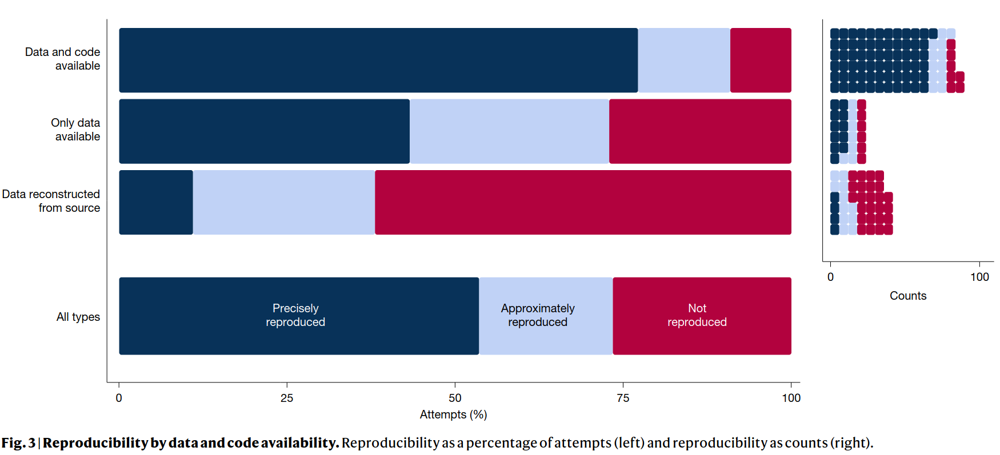
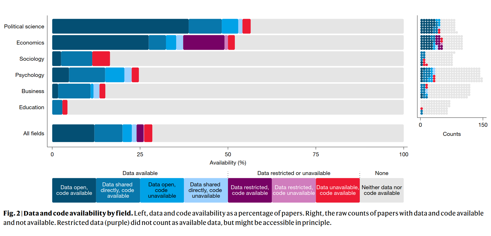
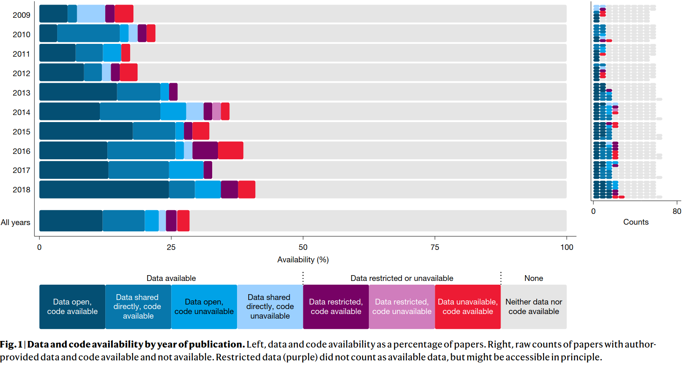
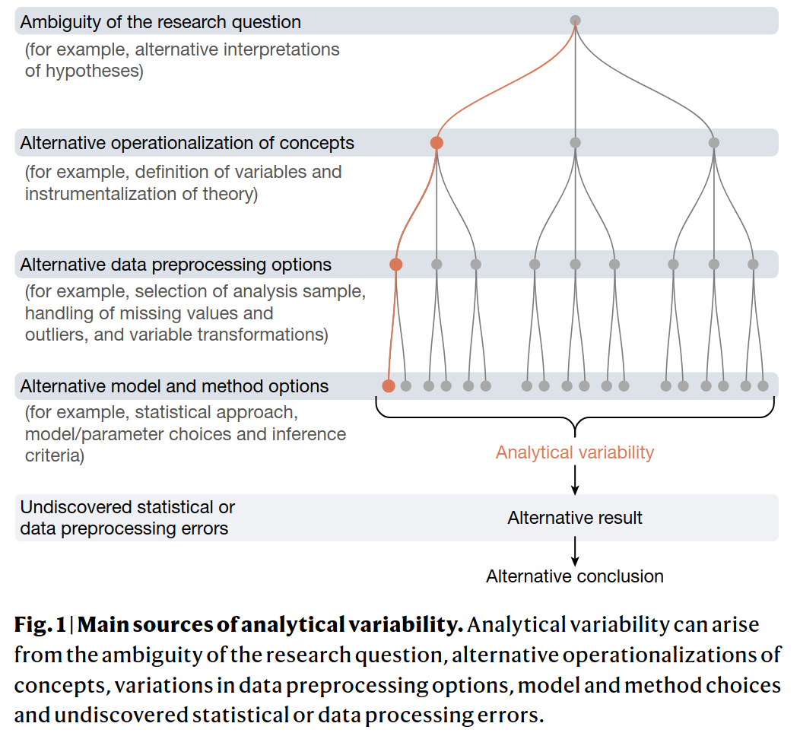
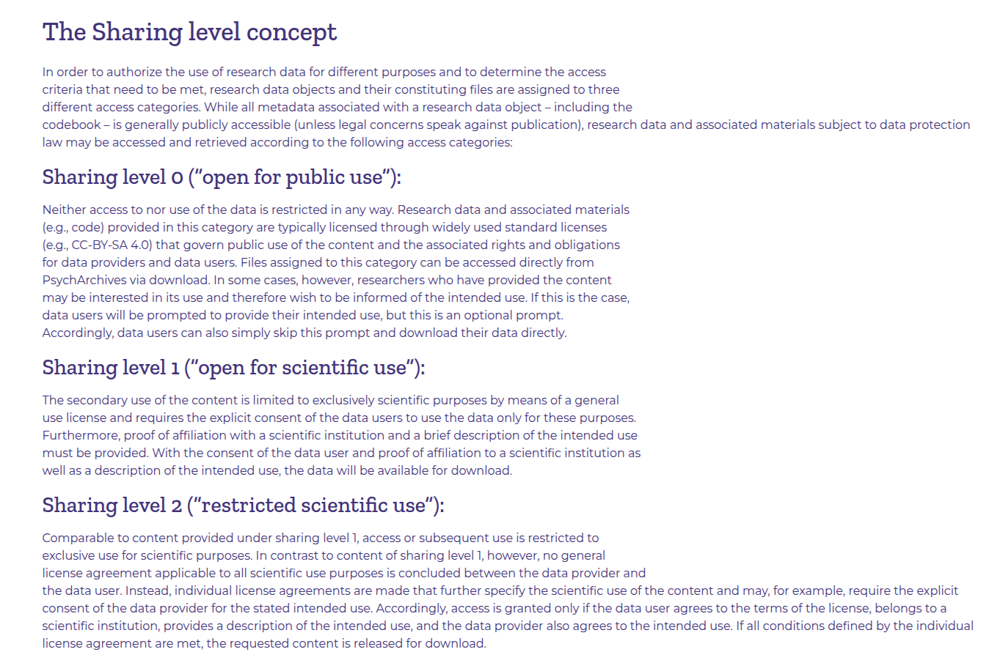
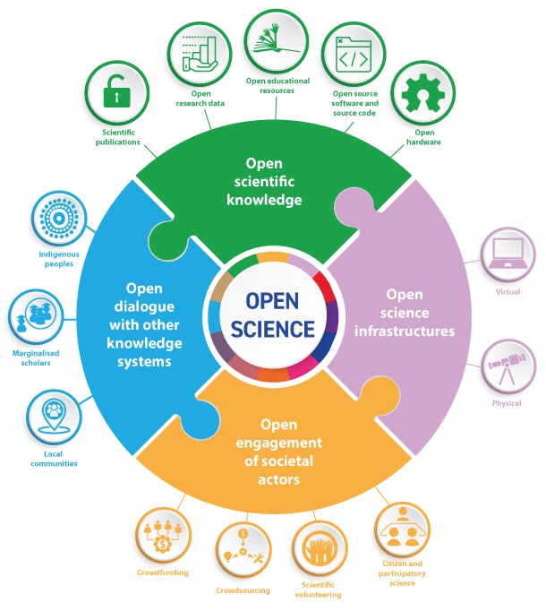

# Titelfolie {.plain}
\center
{width="20%"}

\vspace{2mm}

\Huge
Analyse und Dokumentation
\vspace{4mm}

\Large
BSc Psychologie SoSe 2026

\vspace{5mm}
\large
Belinda Fleischmann


# Termine {.plain}

\setstretch{1.8}
\vfill
\center
\footnotesize

\begin{tabular}{lllll}
Datum     & Gruppe 1  & Gruppe 2  & Format              & Thema                              \\ \hline
Fr, 10.04.2026 & 11-13 Uhr & 13-15 Uhr & Seminar        & (1) Quarto, Zotero, Tidyverse      \\
Fr, 17.04.2026 & 11-13 Uhr & 13-15 Uhr & Seminar        & (2) Forschungsethik                \\
Fr, 24.04.2026 & 11-13 Uhr & 13-15 Uhr & Seminar        & (3) Wissenschaftliche Berichte     \\
Mi, 29.04.2026 & 11-13 Uhr & 13-15 Uhr & Praxisseminar  &  Offene Übung (Quarto und Zotero)  \\
Fr, 08.05.2026 & \textbf{11-13 Uhr} & \textbf{13-15 Uhr} & \textbf{Seminar} & \textbf{(4) Offenheit und Transparenz} \\ \hline
Fr, 15.05.2026 & 11-13 Uhr & 13-15 Uhr & Übung          & Einfache Lineare Regression        \\
Mo, 18.05.2026 & 11-13 Uhr & 15-17 Uhr & Übung          & Korrelation                        \\
Fr, 05.06.2026 & 11-13 Uhr & 13-15 Uhr & Übung          & Einstichproben-T-Test              \\
Mi, 10.06.2026 & 13-15 Uhr & 17-19 Uhr & Übung          & Zweistichproben-T-Test             \\
Fr, 26.06.2026 & 11-13 Uhr & 13-15 Uhr & Übung          & Einfaktorielle Varianzanalyse      \\
Fr, 26.06.2026 & 15-17 Uhr & 17-19 Uhr & Übung          & Zweifaktorielle Varianzanalyse     \\
Fr, 03.07.2026 & 11-13 Uhr & 13-15 Uhr & Übung          & Multiple Regression                \\
Fr, 10.07.2026 & 11-13 Uhr & 13-15 Uhr & Übung          & Kovarianzanalyse                   \\ \hline
Fr, 24.07.2026 &           &           & Klausurtermin  &                                    \\
\end{tabular}

\vfill

# (4) Offenheit und Transparenz - Titelfolie {.plain}
\vfill
\center
\huge
\textcolor{black}{(4) Offenheit und Transparenz}
\vfill


#  
\large
\setstretch{3.0}
\vfill

Motivation

Methodentransparenz 

Datentransparenz

Selbstkontrollfragen
\vfill 

#  
\AtBeginSection{}
\section{Motivation}

\large
\vfill
\setstretch{3.0}

**Motivation**

Methodentransparenz 

Datentransparenz

Selbstkontrollfragen
\vfill 

# Motivation
\vfill
\center
\vspace{8mm}
{width=80%}
\vfill
\flushright
\tiny
@chambers2019


# Das Replizierbarkeitskrisennarrativ

\normalsize

Psychologie – 64 von 100 Studien nicht replizierbar 

* @openscience2015 

Nulleffekte in preregistrierten Replizierbarkeitsstudien 

* @hagger2016, @wagenmakers2017, @odonnell2018

Vehaltensökonomie – 7 von 18  Studien nicht replizierbar 

* @camerer2016

Biologie – 47 von 53 Studien nicht replizierbar 

* @begley2012

Reproduzierbarkeitskrise in Machine-Learning-basierter Wissenschaft 

* @kapoor2022


# Das Replizierbarkeitskrisennarrativ
\vfill

\center
\vspace{3mm}
{width=50%}
\vfill
\flushright
\tiny
@baker2016


# Das Replizierbarkeitskrisennarrativ

\vfill
\center
\vspace{3mm}
{width=60%}
\vfill
\flushright
\tiny
@fanelli2018


# Das Replizierbarkeitskrisennarrativ

\center
\vspace{3mm}
{width=60%}
\vfill
\flushright
\tiny
\textcolor{linkblue}{\url{https://senseaboutscience.org/wp-content/uploads/2019/09/Quality-trust-peer-review.pdf}}


# Das Replizierbarkeitskrisennarrativ

\vfill
\center
\vspace{3mm}
{width=60%}
\vfill
\flushright
\tiny
\textcolor{linkblue}{\url{https://senseaboutscience.org/wp-content/uploads/2019/09/Quality-trust-peer-review.pdf}}

# Das Replizierbarkeitskrisennarrativ
\vfill

\center
\vspace{3mm}
{width=80%}
\vfill
\flushright
\tiny
@cobey2024

# Das Replizierbarkeitskrisennarrativ
\vfill

\center
\vspace{3mm}
{width=80%}
\vfill
\flushright
\tiny
@cobey2024

# Das Replizierbarkeitskrisennarrativ
\vfill

\center
\vspace{3mm}
{width=80%}
\vfill
\flushright
\tiny
@cobey2024


# Das Replizierbarkeitskrisennarrativ
\vfill

[\textcolor{linkblue}{SCORE Project}](https://www.cos.io/score)

\center
\vspace{3mm}
```{=latex}
\begin{columns}[T,totalwidth=\textwidth]
\begin{column}{0.32\textwidth}
\centering
\includegraphics[width=\linewidth]{../Abbildungen/ad_4_sanchez_1.pdf}
\end{column}
\begin{column}{0.32\textwidth}
\centering
\includegraphics[width=\linewidth]{../Abbildungen/ad_4_sanchez_2.pdf}
\end{column}
\begin{column}{0.32\textwidth}
\centering
\includegraphics[width=\linewidth]{../Abbildungen/ad_4_sanchez_3.pdf}
\end{column}
\end{columns}
```


\vfill
\flushright
\tiny
@sanchez-tojar2026


# Das Replizierbarkeitskrisennarrativ
\vfill

[\textcolor{linkblue}{SCORE Project}](https://www.cos.io/score)

\center
\vspace{3mm}
{width=100%}
\vfill
\flushright
\tiny
@miske2026

# Das Replizierbarkeitskrisennarrativ
\vfill

[\textcolor{linkblue}{SCORE Project}](https://www.cos.io/score)


\center
\vspace{-2mm}
{width=100%}
\vfill
\flushright
\tiny
@miske2026

# Das Replizierbarkeitskrisennarrativ
\vfill

[\textcolor{linkblue}{SCORE Project}](https://www.cos.io/score)


\center
\vspace{3mm}
{width=100%}
\vfill
\flushright
\tiny
@miske2026


# Das Replizierbarkeitskrisennarrativ

\vfill

\center
\vspace{3mm}
{width=40%}
\vfill
\flushright
\tiny
@ritchie2020


# 
\AtBeginSection{}
\section{Methodentransparenz}


\large
\vfill
\setstretch{3.0}

Motivation

**Methodentransparenz** 

Datentransparenz

Selbstkontrollfragen
\vfill


# Methodentransparenz  

Ausgangslage

* Academia wertet spannende Resultate höher als sorgfältige Arbeit 
* Academia interessiert sich wenig für die eigentliche Arbeit, sondern die Resultate 
* Academia liebt komplexe Analysen ohne den Anspruch, sie verstehen zu wollen 
* Academia mag keine Nullergebnisse 

Konsequenzen

* Publizierte Resultate sind oft nicht reproduzierbar und aufbaufähig 
* Ressourcenverschwendung 
* Geringes innerakademisches Vertrauen in publizierte Resultate 
* Gefahr des geringen extraakademischen Vertrauens in publizierte Resultate 

Lösung

* Gewährleistung von Reproduzierbarkeit durch Methoden- und Datentransparenz 


# Reproduzierbarkeit, Replizierbarkeit und analytische Robustheit
\setstretch{1.2}
\normalsize
**Reproduzierbarkeit**

\small 

Andere Wissenschaftler:innen nutzen die gleichen Daten und die gleichen 
Datenanalysemethoden und erhalten die gleichen Resultate (cf. @peng2011) 

* Abhängig von der Sorgfältigkeit der wissenschaftlichen Arbeit
* Beeinflussbar
* Menschen machen Fehler

\normalsize
**Replizierbarkeit**

\small

Andere Wissenschaftler:innen nutzen andere (neue) Daten und potentiell 
andere Methoden und kommen zur gleichen Schlussfolgerung wie eine Originalstudie 

* Abhängig von den wahren, aber unbekannten, Parametern 
* Unbeinflussbar


\normalsize
**Analytische Robustheit**

\small

Verschiedene Wissenschaftler:innen nutzen gleiche Daten, aber verschiedene vertretbare Analysemethoden und kommen zur gleichen Schlussfolgerung.

* Abhängig von der methodischen Flexibilität (Researcher Degrees of Freedom)
* Beeinflussbar durch Multiverse-Analysen und Multi-Analyst-Ansätze


# Replizierbarkeit und Reproduzierbarkeit

\center
\vfill
{width=100%}
\vfill

# Reproduzierbarkeit, Replizierbarkeit und analytische Robustheit

\center
\vfill
{width=70%}


\flushright
\tiny
@aczel2026


# Aspekte von Methodentransparenz und Datentransparenz

Wissenschaftliche Qualitätssicherung

* Pre- und Postpublikations-Mehraugenprinzip
* Reproduzierbarkeit bei identischen Daten und Analysen gesichert
* Replikationspotential für neue Daten und Analysen erhöht

Nachhaltigkeit

* Möglichkeit der Datenwiederverwendung in neuen Kontexten 
* Maximierung der Anzahl experimenteller Einheiten
* Ermöglichung automatisierter Metaanalysen

Ethischer Imperativ

* Respekt im Umgang mit öffentlichen Geldern
* Respekt für die Beiträge von Forschungspersonen
* Minimierung von Forschungsrisiken 


# Kernaspekte der Methodentransparenz
\setstretch{2}

Maßnahmen

* Computercode als ausführlichste Form der Dokumentation
* Referenzierung datenanalytischer Skripte in Methods und Results Sections
* Verfügbarkeit zum Zeitpunkt der Veröffentlichung (Preprint/Journal Submission)

Voraussetzungen

* Automatisierte Datenanalyse von Rohdaten zu Abbildungen und Tabellen
* Lesbarer, gut-strukturierter und extensiv kommentierter Code
* Verzicht auf Variablennamen mit persönlichkeitsrelevanten Merkmalen


# 
\AtBeginSection{}
\section{Methodentransparenz}
\large
\vfill
\setstretch{3.0}

Motivation

Methodentransparenz 

**Datentransparenz**

Selbstkontrollfragen
\vfill


# Kernaspekte der Datentransparenz
\setstretch{2}

Maßnahmen


* Digitale Rohdaten als ausführlichste Form der Datengrundlage
* Formatierung anhand akzeptierter Datenstandards
* Verfügbarkeit zum Zeitpunkt der Veröffentlichung (Preprint/Journal Submission)

Voraussetzungen

* Vorliegen digitaler Rohdaten
* Verfügbarkeit von Speicherplatz
* Respekt datenschutzrechtlicher Belange


# Repositorien

[\textcolor{linkblue}{Open Science Framework}](https://osf.io/)

* Nichtkommerzielles Datenrepositorium 
* Projektarchivierung bei Preprint/Journal Submission/Revision
* Seit 2020 beschränkter Speicherplatz pro Projekt

[\textcolor{linkblue}{GitHub}](https://github.com/)

* Kommerzieller Dienst zur Versionsverwaltung für Software-Entwicklungsprojekte.
* Kollaborative Softwareentwicklung (Track Changes)
* Oft irrtümlich zur Analysecodearchivierung benutzt

[\textcolor{linkblue}{Forschungsdatenzentrum des ZPID}](https://rdc-psychology.org/de/homepage-deutsch)

* Digitales Forschungsdatenzentrum für die psychologische Forschung
* Teil der öffentlich finanzierten Leibniz-Gemeinschaft
* Unterstützung bei Dokumentation und Archivierung als kostenpflichtige Services


# Datenstandards
\setstretch{2}

[\textcolor{linkblue}{Brain Imaging Data Structure}](https://bids-specification.readthedocs.io/en/stable/)

* Datenstandard für Neuroimaging- und Verhaltensdaten
* Stetige Weiterentwicklung auf weitere Datenmodalitäten
* @gorgolewski2016

[\textcolor{linkblue}{PsyCuraDat}](https://leibniz-psychology.org/institut/drittmittelprojekte/psycuradat/)

* Datenstandard für psychologische Daten
* Zur Zeit noch in der Entwicklung
* @blask2021


# Datenschutzrechtliche Aspekte

Psychologische Daten sind in aller Regel sensible humane Daten

Datenschutzrechtliche Belange müssen respektiert werden

Das Datenschutzrecht gliedert sich in 

\small
* EU Datenschutzgrundverordnung (\textcolor{linkblue}{\href{https://www.bmi.bund.de/SharedDocs/faqs/DE/themen/it-digitalpolitik/datenschutz/datenschutzgrundvo-liste.html}{DSGVO}}) [EU2016/679]
* Bundesdatenschutzgesetz (\textcolor{linkblue}{\href{https://www.gesetze-im-internet.de/bdsg_2018/}{BDSG}})
* Datenschutzgesetze der Bundesländer

\normalsize
Psychologische Daten fallen in aller Regel unter *personenbezogene Daten*

\small

"Alle Informationen, die sich auf eine identifizierte oder identifizierbare 
natürliche Person beziehen; als identifizierbar wird eine natürliche Person 
angesehen, die direkt oder indirekt, insbesondere mittels Zuordnung zu einer 
Kennung wie einem Namen, zu einer Kennnummer, zu Standortdaten, zu einer 
Online-Kennung oder zu einem oder mehreren besonderen Merkmalen, die Ausdruck 
der physischen, physiologischen, genetischen, psychischen, wirtschaftlichen, 
kulturellen oder sozialen Identität dieser natürlichen Person sind, 
identifiziert werden kann"

# Datenschutzrechtliche Aspekte

\center
\vfill
{width=60%}
\vfill


# Datenschutzrechtliche Aspekte
\center
Möglichkeiten der Datentransparenz beim Umgang mit humanen Daten

\vfill
{width=80%}
\vfill


# Möglichkeiten der Datentransparenz
\large
\textcolor{darkblue}{Public Sharing}

\normalsize

Datenbereitstellung auf weltweit frei zugänglichen Datenplattformen

* Allgemeiner Datenzugang für alle Formen der Datennutzung

Vorteile

* Einfach
* Etabliert 
* Ressourcen sensibel

Nachteile

* Unwiderruflich 
* Gefahr des Datenmissbrauchs
* Unklarer datenschutzrechtlicher Stand (DSGVO)


# Möglichkeiten der Datentransparenz
\large
\textcolor{darkblue}{Restricted sharing}

\normalsize

* Datenzugangsregelung mithilfe von Data Use Agreements

Vorteile

* Risikominimierung
* Klare Verantwortlichkeiten
* Teilweise etabliert

Nachteile

* Restriktiv
* Verantwortlichkeit auf Seiten der Wissenschaftler:innen
* Paternalistisch

# Möglichkeiten der Datentransparenz
\large
\textcolor{darkblue}{Restricted sharing}
\center
\vfill
{width=60%}
\vfill


# Möglichkeiten der Datentransparenz
\large
\textcolor{darkblue}{Restricted sharing}
\center
\vfill
{width=80%}
\vfill


# Möglichkeiten der Datentransparenz
\large
\textcolor{darkblue}{Restricted sharing}

::: {layout-ncol=3 layout-valign="top"}
{width="33%"}

{width="33%"}

{width="33%"}
:::


# Möglichkeiten der Datentransparenz
\large
\textcolor{darkblue}{Dynamic sharing}

\normalsize

* Proband:innenzentrierte Datenplattformen
* Datenzugangsregulation und Monetarisierung durch Proband:innen

Vorteile

* Digitales Empowerment
* Klare Verantwortlichkeiten
* Zukunftsorientiert

Nachteile

* Drop-out
* Nicht etabliert
* Ressourceintensiv


# Möglichkeiten der Datentransparenz
\large
\textcolor{darkblue}{Dynamic sharing }

\normalsize
Die elektronische Patientenakte (?)

\center
\vfill
{width=40%}
\vfill

# Methodentransparenz und Datentransparenz
\center
\vfill
\vspace{5mm}
{width=55%}

[\textcolor{linkblue}{Pillars of Open Science, UNESCO (2021)}](https://unesdoc.unesco.org/ark:/48223/pf0000379949/PDF/379949eng.pdf.multi)
\vfill


#   
\AtBeginSection{}
\section{Selbstkontrollfragen}

\large
\vfill
\setstretch{3.0}

Motivation

Methodentransparenz 

Datentransparenz

**Selbstkontrollfragen**
\vfill

# Selbstkontrollfragen

\vfill
\footnotesize
\setstretch{3}

1. Begründen Sie die Wichtigkeit, die Reproduzierbarkeit von Forschung durch Methoden- und Datentransparenz zu fördern.
1. Erläutern und differenzieren Sie die Begriffe Replizierbarkeit und Reproduzierbarkeit.
1. Nennen und erläutern Sie den Nutzen von Methoden- und Datentransparenz.
1. Nennen Sie die Kernaspekte und Voraussetzungen für Methodentransparenz.
1. Nennen Sie die Kernaspekte und Voraussetzungen für Datentransparenz.
1. Nennen Sie drei Online-Repositorien, die in der Forschung verwendet werden.
1. Nennen Sie zwei Datenstandards, die für die psychologische Forschungs relevant sind.
1. Distkutieren Sie die Vor- und Nachteile verschiedener Formen von Data Sharing.
\vfill


# Referenzen {.allowframebreaks}
\footnotesize
\vfill

